# Diffuse Architecture

Diffuse is a local-first device history product. It captures structured observations, keeps them on the device that observed them, and answers one question: **what changed between two points in time?**

This document describes the whole repository, including the native Kotlin Android app and the four native Swift Apple apps. The detailed Swift package reference remains in [Documentation/Architecture.md](Documentation/Architecture.md); this root document explains how both native implementations fit together without sharing runtime code.

New to the codebase? Read [System context](#system-context), [Two native implementation families](#two-native-implementation-families), [Snapshot as the compatibility contract](#snapshot-as-the-compatibility-contract), and the [Glossary](#glossary) — that is enough to follow any other section.

**Structure**

| | |
| --- | --- |
| **Shape** | [System context](#system-context) · [Two native families](#two-native-implementation-families) · [Repository map](#repository-map) · [Apple package graph](#apple-package-graph) · [Layering rules](#layering-rules) · [Android component graph](#android-component-graph) |
| **Runtime** | [Concurrency and isolation](#concurrency-and-isolation-model) · [Deadlines and cancellation](#deadlines-and-cancellation) · [Capture pipeline](#capture-pipeline) · [Application state machine](#application-state-machine) · [Failure isolation](#failure-isolation) |
| **Data** | [Snapshot contract](#snapshot-as-the-compatibility-contract) · [On-disk layout](#on-disk-layout) · [Schema evolution](#schema-evolution) · [Storage lifecycle](#storage-lifecycle) · [Identity and change IDs](#identity-matching-and-change-ids) |
| **Comparison** | [Diff pipeline](#diff-pipeline) · [Comparison rule reference](#comparison-rule-reference) · [Severity and filtering](#severity-and-filtering) · [Temporal correlation](#temporal-correlation) · [Search](#search) |
| **Product** | [Server-driven surfaces](#server-driven-surfaces) · [Capability matrix](#capability-matrix) · [Scheduling](#scheduling) · [Presentation](#native-presentation-architecture) · [Design system](#design-system) · [Widgets](#widgets-and-complications) · [Export and import](#export-and-import) |
| **Guarantees** | [Privacy boundary](#privacy-boundary) · [Performance](#performance-characteristics) · [Test pyramid](#test-pyramid) · [CI topology](#ci-topology) · [Invariants](#architectural-invariants) · [Glossary](#glossary) |

## System context

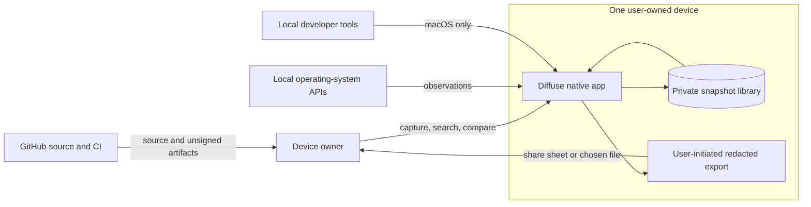

There is no Diffuse account, backend, telemetry service, cloud database, or sync protocol. GitHub hosts source code and CI artifacts; it is not a runtime backend.

## Two native implementation families

The repository contains five apps built from two independent runtime families:

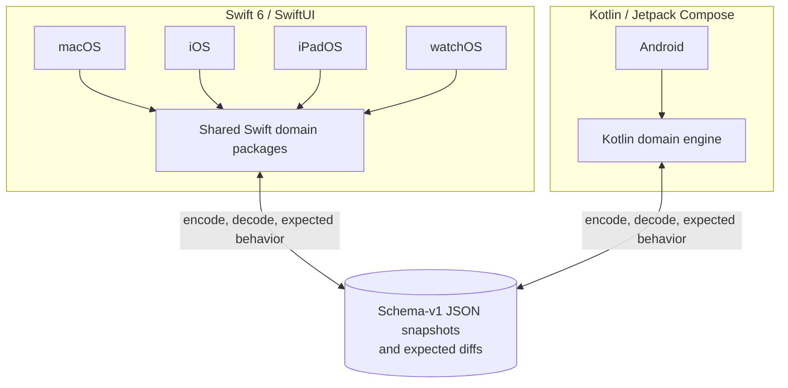

The boundary is intentional:

- Android does not compile, wrap, invoke, or modify the Swift app targets.
- Apple apps do not depend on Gradle, Kotlin, or Android artifacts.
- The shared contract is data and behavior: schema-v1 JSON, stable identifiers, privacy semantics, and golden expected diffs.
- Cross-platform compatibility is proved in tests, not by a shared binary framework.

This keeps every app native while preventing five subtly incompatible snapshot formats.

## Repository map

| Path | Responsibility |
| --- | --- |
| `Packages/` | First-party Swift domain engine and reusable SwiftUI components |
| `Apps/` | macOS, iOS, iPadOS, watchOS, widgets, and complications |
| `Android/` | Kotlin domain engine, collectors, Compose UI, WorkManager scheduling, tests |
| `Tools/` | Swift `diffuse-dev` CLI with no UI dependency |
| `Tests/` | Cross-package Swift domain, invariant, and integration suites |
| `Fixtures/` | Cross-language schema-v1 snapshots and expected diffs |
| `Documentation/` | Engineering guides and architecture decisions |
| `docs/screenshots/` | Live Apple and selected Android product screenshots used by public docs |
| `Scripts/` | Swift bootstrap, format, coverage, cross-check, and verification workflows |
| `.github/workflows/` | Separate Apple and Android CI pipelines plus site publishing |

## Apple package graph

Arrows point toward dependencies. Core packages do not import UIKit, AppKit, WatchKit, or WidgetKit.

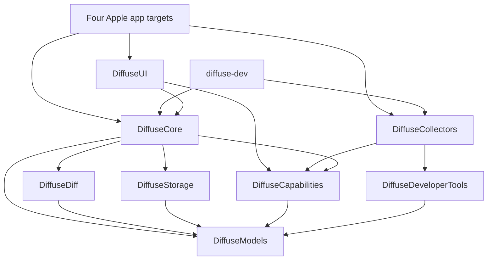

| Swift package | Owns |
| --- | --- |
| `DiffuseModels` | Snapshot vocabulary, schemas, values, privacy, versions, change types |
| `DiffuseDiff` | Pure schema-driven comparison, identity matching, severity, correlation |
| `DiffuseStorage` | JSON coding, file store, queries, validation, migration, retention planning |
| `DiffuseCapabilities` | Capability metadata, catalog, collector protocol, environment abstractions |
| `DiffuseCore` | Capture coordination, service facade, scheduling decisions, search, export, ledger |
| `DiffuseDeveloperTools` | Process runner and macOS developer-tool adapters |
| `DiffuseCollectors` | Platform-specific Apple observation APIs and registries |
| `DiffuseUI` | Generic SwiftUI renderers, design system, preferences, observable app model |

The four Apple apps share the engine and components, but each owns its root navigation and scheduling driver:

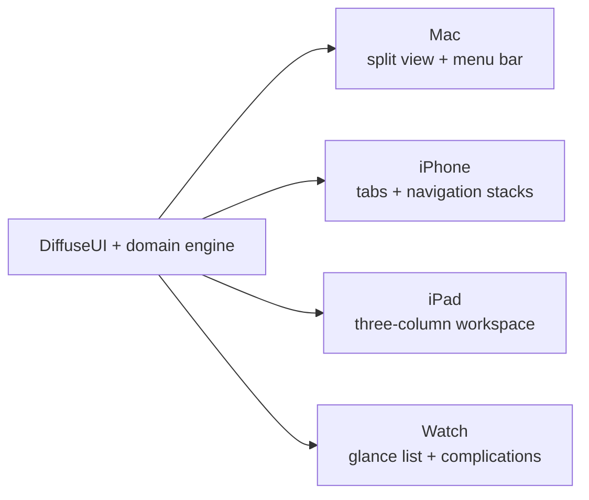

### Layering rules

The graph above is not a description of how imports happen to have settled — it is enforced, and the rules are what keep the engine portable and the CLI possible.

| Rule | Why it exists | How it is caught |
| --- | --- | --- |
| `DiffuseModels` imports only `Foundation` | It is the language both engines speak. A UI or platform import here would make the vocabulary un-shareable and un-testable. | Compile failure — nothing else is linked |
| `DiffuseDiff`, `DiffuseStorage`, `DiffuseCapabilities` depend on `DiffuseModels` and nothing else first-party | Keeps each one independently testable, and lets `diffuse-dev` link the engine without dragging in SwiftUI | Package graph; `swift build` |
| No core package imports UIKit, AppKit, WatchKit, or WidgetKit | A Mac-only API leaking into shared code breaks the Watch build weeks later, in CI, far from the change that caused it | `Scripts/crosscheck.sh` type-checks the shared packages against the iOS and watchOS SDKs on every run of `make verify` |
| `DiffuseUI` may import SwiftUI but not `DiffuseCollectors` | Presentation renders schemas, never a specific capability | Package graph |
| Apps depend on packages; packages never depend on apps | `Apps/Shared` holds the widget bridge precisely because `DiffuseUI` cannot import WidgetKit | Package graph |
| Android imports nothing from the Swift tree, and vice versa | The two families share data and behaviour, not binaries | Separate build systems |

The practical consequence is that the entire capture → diff → export path is exercisable from a command line with no simulator, which is why `diffuse-dev` exists and why the domain suites run in under ten seconds.

### Concurrency and isolation model

Diffuse is written for Swift 6 language mode with complete concurrency checking on, so isolation is a compile-time property rather than a convention.

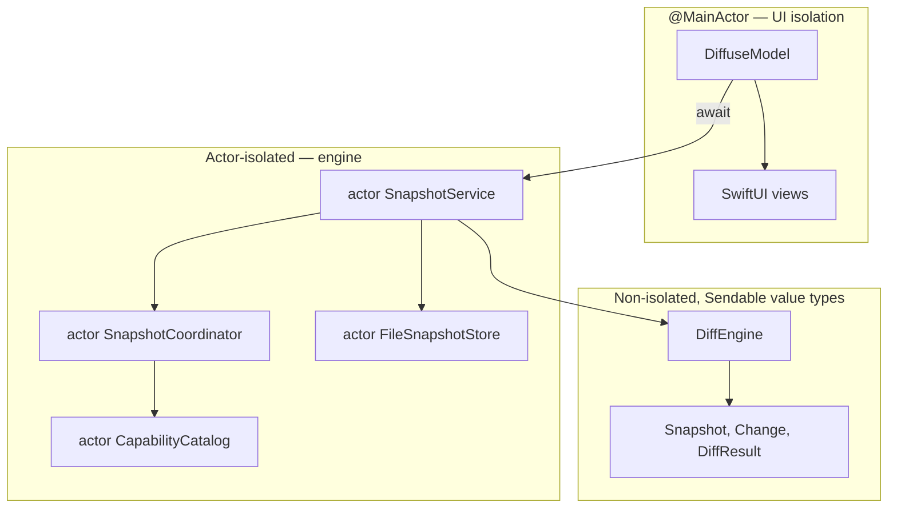

Three layers, three different isolation strategies:

- **`@MainActor`** covers `DiffuseModel` and everything SwiftUI touches. Every published property mutation is already on the main actor, so no view ever reads a half-updated model.
- **Actors** own everything with mutable state or I/O: the service facade, the capture coordinator, the capability catalog, and both stores. Store writes are serialised by actor isolation rather than an explicit lock, which is why concurrent captures cannot interleave a half-written library.
- **Plain `Sendable` value types** carry everything that crosses those boundaries. `Snapshot`, `Change`, and `DiffResult` are immutable structs, so handing one from the coordinator to the main actor is a copy, not shared mutable state. `DiffEngine` is a pure function over two of them and has no isolation at all — which is exactly why it can run on any thread and why `diff(A, A)` is trivially reproducible.

Capture fans out with `withThrowingTaskGroup`: every enabled capability runs concurrently, and the coordinator collects results as they arrive. Collectors are independent by construction — none of them observes another's output — so there is no ordering to preserve and no shared state to guard.

### Deadlines and cancellation

A collector can shell out to a subprocess, and a subprocess can hang forever. The coordinator therefore races every collector against a deadline derived from its declared cost:

| `CollectionCost` | Deadline | Typical collector |
| --- | --- | --- |
| `.low` | 2 s | In-memory system APIs — device identity, battery, display metrics |
| `.moderate` | 5 s | Filesystem or framework enumeration — volumes, network interfaces, installed apps |
| `.high` | 12 s | Subprocess work — developer-tool version probes, git metadata |

Declaring the cost is how a collector opts into a realistic deadline; it also drives whether the capability is included in frequent automatic snapshots at all. A collector that blows its deadline is cancelled and its section is recorded as `timedOut`. **The snapshot still saves.** One badly behaved subprocess cannot hold the whole capture hostage, and the user sees a diagnostic on that one section rather than a spinner that never resolves.

## Android component graph

Android mirrors product behavior in Kotlin without trying to mirror Swift file-for-file.

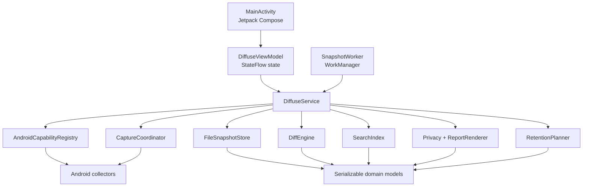

The main Android layers are:

- `domain/`: platform-free snapshot models, JSON coding, diff, privacy, retention, storage, search, and reports.
- `collectors/`: Android API access for device, system, battery, display, storage, connectivity, and interfaces.
- `core/`: service orchestration, deadlines, preferences, schedule decisions, and WorkManager entry points.
- `ui/`: lifecycle-aware `ViewModel`, immutable `DiffuseUiState`, theme, and Compose screens.

Android declares `ACCESS_NETWORK_STATE` but no `INTERNET` permission. Snapshot and preference paths are excluded from Android backup and device transfer rules.

## Snapshot as the compatibility contract

A snapshot carries both observations and the schema needed to interpret them later.

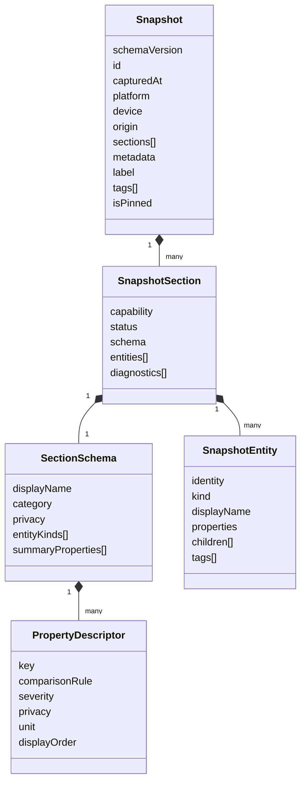

Important consequences:

1. A newer app can display an old or unknown capability because presentation metadata travels with the data.
2. The diff engine does not need branches such as `if capability == wifi`.
3. A schema change is a compatibility event; additive descriptors are preferred.
4. Stable capability, entity, property, and change identifiers make golden fixtures deterministic across Swift and Kotlin.

## Capture pipeline

Both implementations follow the same semantic sequence, even though their concrete types differ.

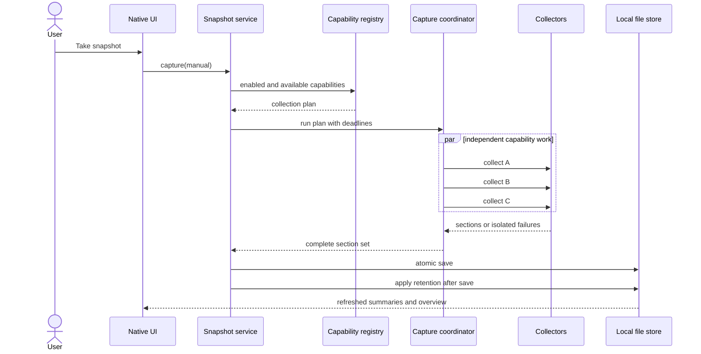

Collector failure is data, not an app-wide failure. A collector can report collected, skipped, unavailable, permission-required, failed, or timed-out status. The snapshot survives with diagnostics and every successful section intact.

## Diff pipeline

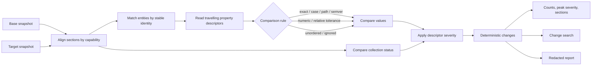

The schema owns comparison rules and privacy classification. The engine owns generic mechanics. Collectors never pre-compute a textual diff.

### Comparison rule reference

Every rule is a property of the *descriptor*, which travels inside the snapshot. That is what lets a snapshot exported by an older build still compare correctly on a newer one, and what keeps the engine free of `if capability == wifi` branches.

| Rule | Equal when | Exists because |
| --- | --- | --- |
| `exact` | Byte-for-byte identical | The default. Anything discrete: names, identifiers, enum-like strings |
| `caseInsensitive` | Equal ignoring case and surrounding whitespace | Vendor strings and model names that change capitalisation between OS releases |
| `pathNormalized` | Equal after home-directory and trailing-separator normalization | `/Users/ana/bin` and `~/bin/` are the same directory; a diff that disagrees is noise |
| `semanticVersion` | Equal by semver precedence — `1.2.0` equals `1.2` | Version strings must not compare as text, or `1.9.0 → 1.10.0` reads as a downgrade |
| `numeric(tolerance:)` | Within an absolute tolerance, in the property's own unit | Temperature wobbling by a degree is not a change |
| `relative(tolerance:)` | Within a fraction of the larger value | Free disk space drifts constantly; a fixed byte tolerance is wrong at every scale |
| `unordered` | Same elements, any order | A list whose order is an implementation detail of the API that produced it |
| `ignored` | Always | Timestamps and monotonic counters that are pure noise. Recorded for display, never diffed |

When a descriptor does not name a rule, the unit picks a sensible default — and these defaults are where most of the signal-to-noise ratio actually comes from:

| Unit | Default rule | Reasoning |
| --- | --- | --- |
| `bytes` | `relative(0.01)` | 1% — a disk that moved by a few megabytes has not "changed" |
| `percent` | `numeric(0.05)` | Battery and utilisation readings are sampled, not exact |
| `seconds` | `relative(0.1)` | Uptime and durations are inherently approximate |
| `celsius` | `numeric(2)` | Thermal sensors fluctuate on their own |
| `path` | `pathNormalized` | Paths are compared as locations, not strings |
| `version` | `semanticVersion` | Precedence, never lexicographic |
| `timestamp` | `ignored` | A timestamp changing is not news; the thing it timestamps changing is |

A tolerance-based comparison that lands close to its threshold produces a change with **confidence below 1**, which the UI can use to distinguish a real movement from measurement noise. Exact comparisons are always confidence 1.

### Severity and filtering

Severity is declared by the schema, not inferred by the engine. A property descriptor names the severity of a change to that property; an entity-kind descriptor names the severity of the entity appearing or disappearing.

`informational < notable < significant < critical`, strictly ordered by rank. Escalation saturates at both ends — `critical.escalated()` is still `critical` — so a rule that bumps severity can be applied repeatedly without overflowing off the scale.

Filtering happens twice, for different reasons:

- **At diff time**, `DiffOptions.minimumSeverity` omits changes below the threshold from the result entirely. This is a cost decision: the CLI and report generator do not pay to carry changes nobody will read.
- **At view time**, `DiffuseModel.minimumSeverity` filters an already-computed diff. This is an interaction decision: moving the severity slider must be instant and must not recompute anything.

Section-status changes (`collected → permissionRequired`) are reported as `notable`, and an entity that appears where none was before is `informational` unless its descriptor says otherwise.

### Temporal correlation

Clustering is deterministic time-bucketing, not inference. Changes whose observation times fall within `correlationWindow` of each other are grouped so the user can see that four things moved together.

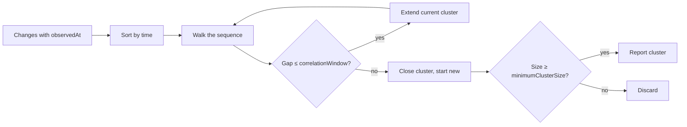

Defaults: a 300-second window and a minimum of two changes, so a single isolated change never becomes a "cluster of one". `DiffOptions.exhaustive` drops the minimum to one and emits unchanged entities too — that mode exists for the CLI's verbose output and for tests, not for the UI.

A change's `observedAt` is the capture time of the later snapshot, refined by that section's own collection time where available. That refinement is what makes clustering meaningful at all: without it every change in a snapshot would share one timestamp and every diff would be exactly one cluster.

## Storage lifecycle

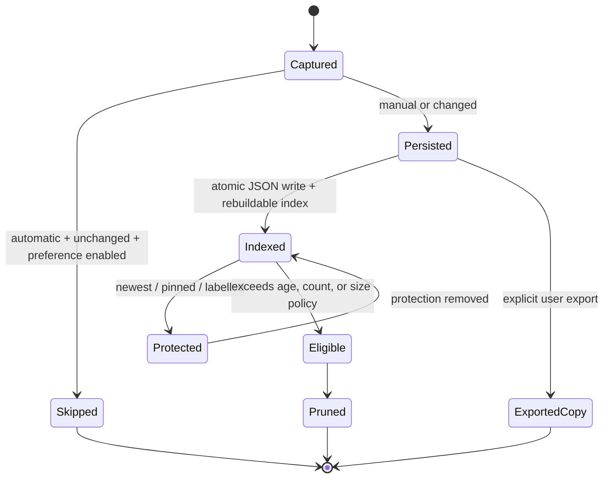

The newest snapshot is never pruned. Retention runs after a successful save. Index files are accelerators and can be rebuilt from snapshot envelopes.

## Privacy boundary

Collection and export deliberately use different policies: useful sensitive values remain available for local comparison, then are classified and redacted when the user shares.

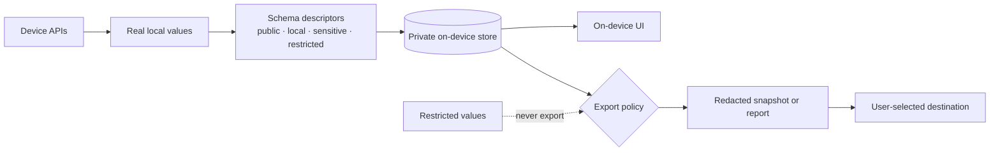

`restricted` values never export, including under the least restrictive policy. Redaction is not encryption and does not replace FileVault, device passcodes, or operating-system app isolation.

## Scheduling

Scheduling mechanisms are platform-native while product rules remain aligned.

| Platform | Driver | Product behavior |
| --- | --- | --- |
| macOS | Timer plus wake/unlock notifications | Cadence and system-event capture with a 15-minute floor |
| iOS / iPadOS | Background app refresh plus capture-on-open | Opportunistic, never presented as a daemon |
| watchOS | Watch application refresh task | Standalone scheduled glance updates |
| Android | WorkManager plus capture-on-open due check | Persistent periodic work within Android’s scheduling constraints |

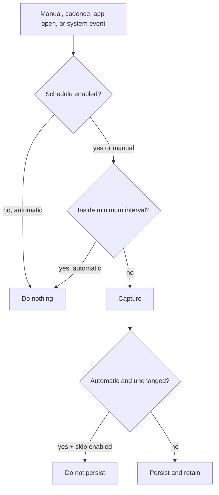

Manual capture always persists. Automatic skip-if-unchanged belongs in the service layer, not the scheduler.

## Native presentation architecture

Each app renders the same concepts using navigation appropriate to its device.

| App | Primary screens | Distinct behavior |
| --- | --- | --- |
| macOS | Overview, Snapshots, Compare, Capabilities, Privacy, Settings | Split view, menu bar extra, repo configuration, developer tools |
| iPhone | Overview, Snapshots, Compare, Settings, snapshot/entity detail | Tab view, navigation stacks, background refresh, widgets |
| iPad | Snapshots, Changes, Clusters/detail, settings/privacy/capability sheets | Persistent three-column analytical workspace |
| Watch | Glance, snapshot detail, change detail, settings | Standalone compact history and complications |
| Android | Overview, Snapshots/search, Compare, Settings/privacy, snapshot detail | Adaptive bottom navigation/navigation rail, Compose cards, WorkManager |

Reusable chip components are indivisible: their text remains on one line, while `ChipFlowLayout` on SwiftUI and `FlowRow` on Compose move complete chips to a new row at narrow widths.

### Design system

`DiffuseUI` holds one set of tokens that all four Apple apps draw from, and the Android app mirrors the same vocabulary in Compose. Sharing tokens rather than screens is what makes the product read as one instrument across a 46 mm watch and a 13-inch iPad without any of them looking like a port of another.

| Token group | Contents | Rule |
| --- | --- | --- |
| Palette | `accent`, `ink`, `paper`, `canvas`, `surface`, `surfaceRaised`, `hairline`, `subtleText`, plus one colour per severity | `ink` is the text colour and `canvas` is the page colour. Using one where the other belongs is the single easiest way to wash out a screen |
| Spacing | `hair` 2, `tight` 4, `small` 8, `medium` 12, `regular` 16, `large` 24, `section` 32 | Never a raw number in a view |
| Radius | `small` 6, `medium` 10, `large` 16, `pill` 999 | Corner treatment is a token so cards match across platforms |
| Motion | `responsive` (spring), `arrival` (ease-out) | Animations respect Reduce Motion |

The accent is blueprint indigo rather than system blue or the generic AI-product violet: Diffuse is an instrument for reading diffs, so it borrows the colour of a drawing.

Severity has exactly one visual vocabulary — a dot, a badge, and a proportional bar — and every surface uses those three components rather than inventing a lookalike. That is enforced socially rather than mechanically, but it is why the Watch glance and the Mac overview show the same reading in the same way at wildly different sizes.

Two layout rules exist because they were violated and produced real bugs:

- **Chips wrap, they do not shrink.** A `SeverityBadge` is `fixedSize` horizontally, so a row that runs out of width must add a row. A fixed `HStack` of badges clipped to "2 Informa…" on a 46 mm watch until it was moved to `ChipFlowLayout`.
- **Branch on measured width, not on size class alone.** Every iPad is `.regular` in portrait, but an iPad mini is 744 pt against a column layout that needs 840 pt. A size-class-only branch clipped the workspace on exactly one device.

## Cross-language verification

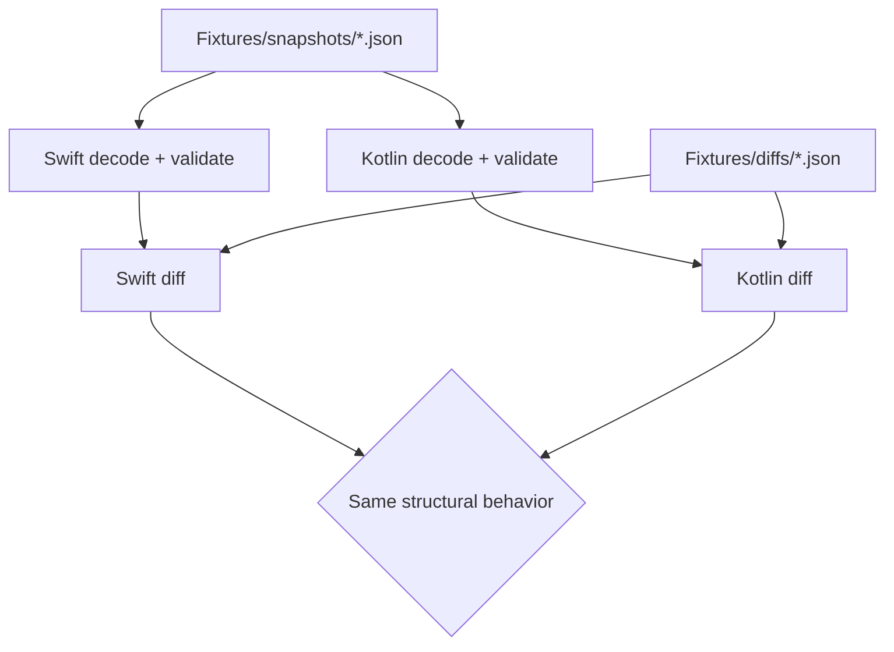

The test strategy has three layers:

- Pure domain suites pin comparison, privacy, storage, retention, scheduling, search, reporting, and serialization.
- Integration suites exercise capture → store → diff → search → export and cross-language fixtures.
- Native UI/instrumentation tests and live emulator review cover navigation, dialogs, adaptive layouts, and platform collectors.

Swift verification also type-checks shared packages against iOS and watchOS SDKs and builds all Apple targets unsigned. Android CI enforces Kotlin domain line coverage and builds unsigned debug/release artifacts.

## Extension rules

### Add an Apple capability

1. Define its typed section and travelling schema.
2. Implement a collector in `DiffuseCollectors`.
3. Register it only on platforms that can observe it.
4. Add fake-based and integration coverage.
5. Update fixtures only when the serialized contract genuinely changes.

Do not add capability-specific branches to UI, storage, export, search, or diff.

### Add an Android capability

1. Define explicit metadata and descriptors in the Android collector layer.
2. Implement platform reads in `collectors/`.
3. Register it in `AndroidCapabilityRegistry`.
4. Classify every property and add JVM plus device tests.
5. Confirm schema-v1 compatibility if the capability is shared conceptually with Apple.

### Add a comparison rule

A genuinely new comparison semantic must be implemented in both engines if it can appear in shared fixtures. Add direct behavior tests, reverse/self-diff invariants, and a golden case before using it in a collector.

## Capability matrix

Collectors register only where the hardware can actually observe the fact. A Watch never pretends to be a Mac.

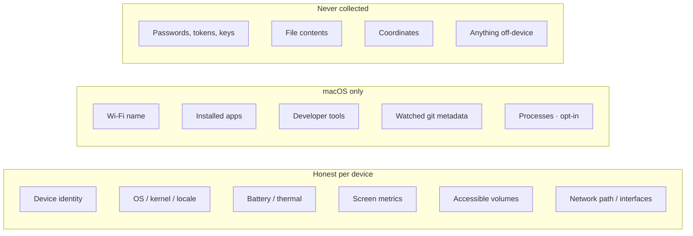

| Observation | macOS | iPhone / iPad | Watch | Android |
| --- | --- | --- | --- | --- |
| Device identity, OS version | yes | yes | yes | yes |
| Battery / power | yes | yes | yes | yes |
| Display metrics | yes | yes | size only | yes |
| Storage | all volumes | app container | container | app data volume |
| Network path / interfaces | yes | yes | path | connectivity + interfaces |
| Wi-Fi SSID | Location, sensitive | no | no | no |
| Installed applications | yes | no | no | no |
| Developer-tool versions | yes | no | no | no |
| Watched git metadata | yes | no | no | no |
| Process table | opt-in | no | no | no |
| Accounts, hardware IDs, file contents | never | never | never | never |

Adding Bun on Mac is a tool adapter. Adding Bluetooth peripherals is a new capability, a collector, a registry line, and tests — not a new screen.

## On-disk layout

Both engines persist pretty-printed JSON the owner can open in a text editor. Index files are accelerators and can be rebuilt.

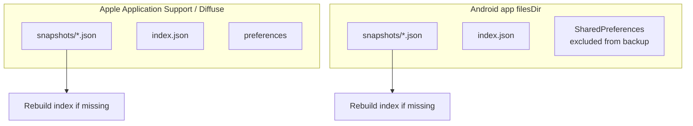

Apple path: `Application Support/Diffuse/` on that device. Android path: the app-private files directory; snapshots and preferences are excluded from Android backup and device transfer. Neither tree is an iCloud or Drive folder.

A snapshot file is an envelope around the snapshot object so unknown future fields round-trip. A bare snapshot without an envelope still decodes.

### Schema evolution

The schema is at `v1` and the migration chain is deliberately empty. That is a statement of intent, not an omission: the machinery exists and is validated so that the first real migration is a small, tested change rather than an architectural one.

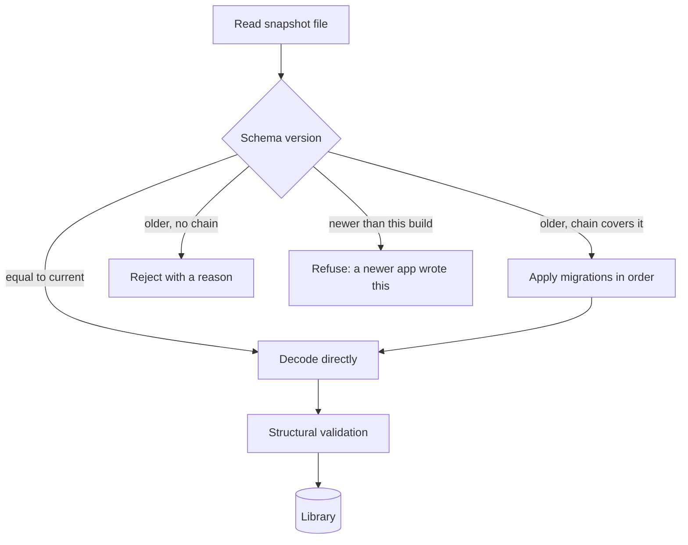

Four rules govern changes to the serialized contract:

1. **Additive descriptors are free.** A new property on an entity kind, or a new entity kind in a section schema, does not need a version bump — presentation metadata travels with the data, so an older reader ignores what it does not recognise and a newer reader displays it without code changes.
2. **Renaming or retyping a field is a version event.** It needs a migration and a golden fixture demonstrating the upgrade.
3. **A snapshot from the future is refused, never guessed at.** `SnapshotValidator` reports a version newer than the running build as a problem rather than decoding it partially.
4. **Round-tripping is a validated invariant.** `SnapshotValidator.validateRoundTrip` encodes, decodes, and re-encodes, and requires the results to be identical both times. This is what makes exports trustworthy and golden fixtures stable — and it fails loudly with the *name of the first differing field* rather than "something changed", because an unactionable failure message on a serialization bug costs hours.

`SnapshotMigrator.validateChain()` checks the migration list is contiguous and ordered, so a chain with a gap fails a test rather than silently skipping a version at runtime.

### Application state machine

Everything the four Apple apps display is derived from one observable phase on `DiffuseModel`.

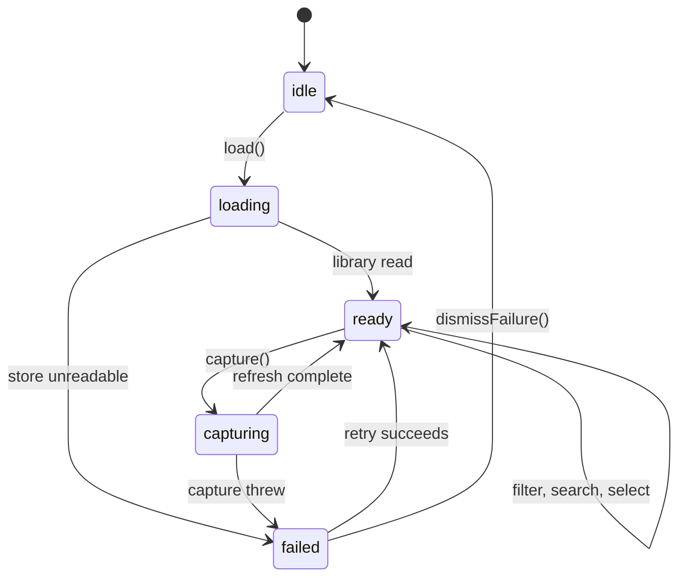

Two properties of this machine matter more than the shape:

- **`capture()` is re-entrant-safe by guard, not by luck.** It returns immediately if the phase is already `capturing`, so a double-tapped button, a scheduler firing mid-capture, and a background task arriving at the same moment cannot produce two concurrent captures.
- **A failure is a value, not a crash.** `failed(String)` carries a human-readable reason to a dismissible banner. There is no path where an unreadable library, a denied permission, or a malformed import file takes down the app — the same principle as collector isolation, applied one layer up.

Filtering, searching, and comparison selection never change the phase. They are pure derivations over state that is already loaded, which is what keeps the severity slider and the search field instant.

### Performance characteristics

Diffuse is a local tool operating on human-scale data, and the design leans on that rather than pretending otherwise.

| Operation | Cost | Note |
| --- | --- | --- |
| Capture | Bounded by the slowest collector, capped by its deadline | Fan-out is concurrent, so the total is the max rather than the sum |
| Diff | Linear in entity count | Entities are matched through a dictionary keyed by stable identity, never by an n² scan |
| Library list | Reads `index.json`, not the snapshots | The index exists so that showing a timeline never decodes a snapshot body |
| Library search | Builds an index on first query, cached until the library changes | Rebuilt rather than incrementally maintained: simpler, and the input is small |
| Widget draw | Reads a two-field JSON file | A widget must never decode a snapshot; see [Widgets and complications](#widgets-and-complications) |
| Retention | Runs after a successful save | Never on a read path, so listing snapshots cannot block on pruning |

The index is an accelerator and is treated as disposable — if it is missing or unreadable it is rebuilt from the snapshot envelopes. That is a deliberate trade: the snapshots are the source of truth, and no bug in index maintenance can lose data.

## Identity matching and change IDs

The diff engine never keys entities by array order.

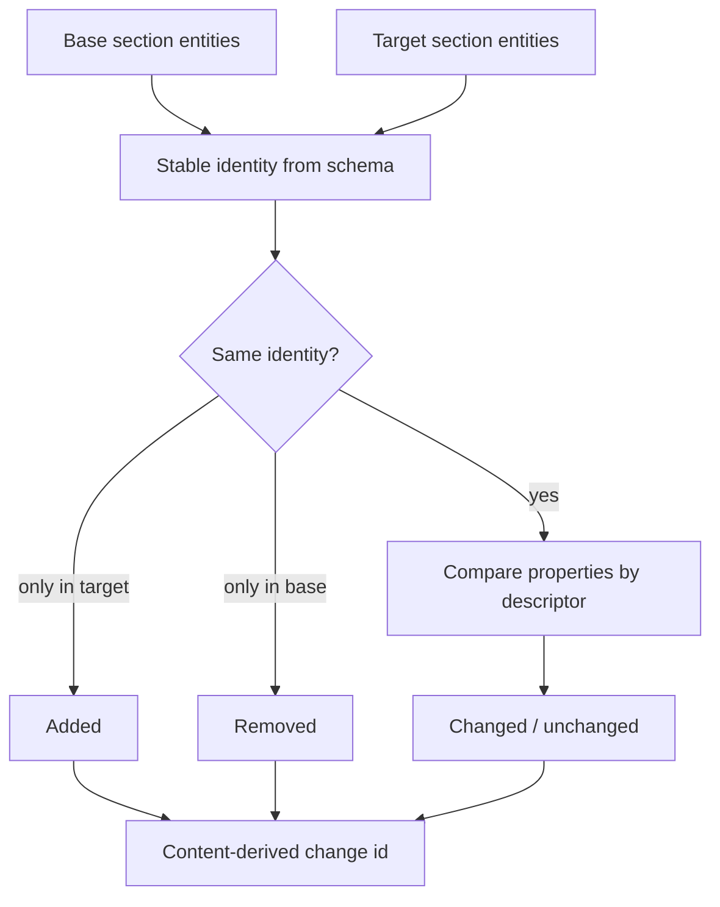

Change identifiers are hashes of capability, entity identity, property, and the compared values. Shuffling entity order does not change the set of change IDs. `diff(A, A)` is empty. Reversing a diff swaps additions and removals.

## Search

Library search and comparison search are different indexes over the same vocabulary.

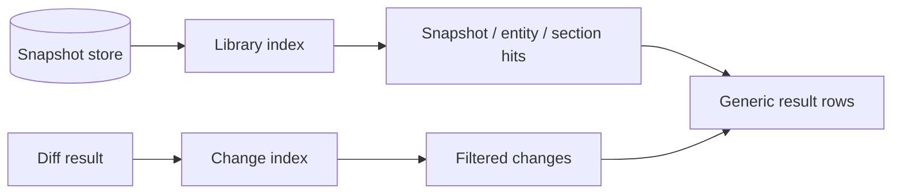

Empty-query change search is a no-op filter (show everything). Library search requires a term. Neither index stores file contents; they tokenize display names, identities, capability ids, and property labels that already live in the snapshot.

## Widgets and complications

Apple widgets never decode a snapshot. After a successful persist the host app writes a tiny summary into the app group.

```mermaid
sequenceDiagram
    participant App as Host app
    participant Store as Snapshot store
    participant Group as App group container
    participant Widget as Widget / complication

    App->>Store: persist snapshot
    Store-->>App: latest summary
    App->>Group: change-count.json
    Widget->>Group: read count + peak severity
    Note over Widget: unsigned CI has no container, so widgets show empty
```

| Surface | Group |
| --- | --- |
| iOS widgets | `group.com.diffuse.ios` |
| iPadOS widgets | `group.com.diffuse.ipados` |
| watchOS complications | `group.com.diffuse.watch` |

## Export and import

Export is a user action. Import is a file the user picked. Neither is sync.

```mermaid
flowchart TD
    Local[(On-device snapshot)] --> Policy{Redaction policy}
    Policy -->|none| StillRestricted[Restricted still stripped]
    Policy -->|standard| DropSensitive[Drop sensitive+]
    Policy -->|strict| PublicOnly[Public only]
    StillRestricted --> File[JSON or Markdown]
    DropSensitive --> File
    PublicOnly --> File
    File --> Share[Share sheet / chosen path]
    Picked[User-picked JSON] --> Validate[Decode + validate]
    Validate --> Imported[(Appended to local store)]
```

Android uses the system document picker and share sheet. Apple uses `fileImporter` / `ShareLink`. `restricted` values never appear in either format.

## Test pyramid

```mermaid
flowchart TB
    UI[Simulator / emulator UI<br/>navigation, dialogs, rotation]
    Integ[Integration<br/>capture → store → diff → search → export]
    Domain[Domain + invariants<br/>comparison, privacy, retention, fixtures]

    UI --> Integ
    Integ --> Domain
```

Cross-language proof lives at the domain layer: Kotlin decodes Swift golden snapshots and structurally matches expected diffs. UI tests do not redefine comparison rules.

| Layer | Apple | Android |
| --- | --- | --- |
| Domain | Swift Testing, 588 tests in 76 suites | JUnit + coroutine test, 96 tests |
| Coverage gate | `llvm-cov`, fails under 90% (currently 92.4%) | JaCoCo, fails under 90% of `…android.domain` (currently 97.7%) |
| Fixtures | `Fixtures/snapshots` + `Fixtures/diffs` | The same files, decoded in Kotlin |
| Device | Unsigned simulator builds | 15 Compose instrumentation tests on emulator |
| Static | SwiftFormat + SDK cross-check | Android Lint + R8 on release |

Two things the coverage numbers do *not* mean. The Swift figure includes SwiftUI view bodies because `Tests/Domain/ViewRenderingTests.swift` renders every public `DiffuseUI` view through `ImageRenderer`, which evaluates a whole body — a view that traps on a nil optional or an empty collection fails the suite instead of shipping to four apps at once. The Android figure is scoped to the pure Kotlin domain package on purpose: Compose UI, the framework collectors, and `MainActivity` are only reachable on a device, and folding them into a JVM number would either require mocks that prove nothing or push the threshold down to something meaningless. They are covered by the instrumentation suite instead.

## CI topology

```mermaid
flowchart LR
    Push[push / PR] --> AppleCI[ci.yml · macOS]
    Push --> AndroidCI[android.yml · Ubuntu]
    Push --> Pages[pages.yml · marketing site]

    AppleCI --> Format[SwiftFormat lint]
    AppleCI --> Tests[swift test + llvm-cov]
    AppleCI --> Cross[iOS / watchOS type-check]
    AppleCI --> Unsigned[Unsigned app matrix]

    AndroidCI --> JVM[Gradle unit tests]
    AndroidCI --> Jacoco[Domain coverage gate]
    AndroidCI --> Lint[Android Lint]
    AndroidCI --> Emu[Emulator instrumentation]
    AndroidCI --> APK[Unsigned APK / AAB]
```

Pages deploys only `index.html`, `404.html`, `web/`, and the small SEO files — never the Swift or Android trees. Signing identities are not present in any workflow.

## Failure isolation

A collector is allowed to fail. The snapshot is not.

```mermaid
stateDiagram-v2
    [*] --> Collecting
    Collecting --> Collected: success
    Collecting --> Skipped: disabled
    Collecting --> Unavailable: hardware missing
    Collecting --> PermissionRequired: OS denied
    Collecting --> Failed: thrown error
    Collecting --> TimedOut: deadline
    Collected --> Snapshot
    Skipped --> Snapshot
    Unavailable --> Snapshot
    PermissionRequired --> Snapshot
    Failed --> Snapshot
    TimedOut --> Snapshot
```

Diagnostics travel with the section. The UI renders status; it does not crash the library.

## Server-driven surfaces

Diffuse may ship on the App Store and Play Store, where a release takes days. A
confusing help section or a typo in onboarding should not wait that long. Every
mature store app solves this with server-driven UI.

Diffuse cannot fetch anything: [ADR 0001](Documentation/adr/0001-local-first.md)
and [ADR 0008](Documentation/adr/0008-no-cloud-sync.md) make local-first a
product guarantee and the Android app declares no `INTERNET` permission.

So the runtime is built and **the transport is not**. See
[ADR 0010](Documentation/adr/0010-server-driven-surfaces.md).

```mermaid
flowchart TB
    Source["SurfaceSource<br/>bundled today"] --> Resolve[SurfaceResolver]
    Resolve --> Compat{Compatible?}
    Compat -->|"schema too new"| FB[Native fallback]
    Compat -->|"app too old"| FB
    Compat -->|empty| FB
    Compat -->|yes| Prune[Prune unrenderable nodes]
    Prune --> Any{Any left?}
    Any -->|no| FB
    Any -->|yes| Render["Render with DiffuseTheme"]
    Prune --> Problems[Problems reported as diagnostics]
```

This is the idea behind [ADR 0003](Documentation/adr/0003-schema-driven-diff.md)
applied one level up. A snapshot already carries the schema needed to render a
capability the build has never heard of; a surface carries the description of a
*screen region* the build has never seen. Both refuse to trap on the unknown,
and both degrade rather than fail.

| Layer | Where |
| --- | --- |
| Model, validation, sources, resolver | `DiffuseSurface` — Foundation only, no dependencies |
| SwiftUI renderer | `DiffuseUI/Surface/SurfaceRendering.swift` |
| Kotlin model + resolver | `com.diffuse.android.domain.sdui` |

`DiffuseSurface` deliberately depends on nothing, so the same rules run in tests,
in `diffuse-dev`, and in a future publishing pipeline that wants to reject a bad
payload *before* it reaches a device.

### What a payload may and may not do

| May | May not |
| --- | --- |
| Supply text, ordering, and structure | Supply colours, fonts, or spacing |
| Name an action the host already implements | Describe behaviour, expressions, or scripts |
| Introduce a node type this build skips | Reach snapshots, the diff engine, or privacy handling |
| Gate itself to a minimum app version | Force a screen to render nothing |

Actions are **names**. A surface can ask for `capture`; it cannot say what
capturing means. That indirection is what keeps a data channel from becoming an
execution channel.

### Why a surface cannot break a screen

| Failure | Result |
| --- | --- |
| No payload, or it will not decode | Native fallback |
| `schemaVersion` or `minimumAppVersion` too new | Native fallback, surface refused whole |
| Every node unknown | Native fallback |
| *Some* nodes unknown or missing a required property | Pruned individually; siblings render |
| Action with no handler | Renders, control disabled, problem reported |

Deleting every published payload returns the apps to exactly what they ship
with. That is what makes the feature additive rather than load-bearing.

### Adding a publisher later

One new `SurfaceSource` and one line of wiring. The renderer, validator,
resolver, and every test stay untouched. The code cost is small; the cost that
matters is the rest — an `INTERNET` permission visible on the store listing, a
privacy-disclosure change, a cache and staleness policy, and an amendment to
ADR 0001, 0008, and 0010. That is a product decision, not a refactor, which is
exactly why the seam exists and the transport does not.

## Architectural invariants

- Snapshots never leave a device without a user-initiated export.
- There is no account, cloud sync, telemetry, or snapshot upload.
- Apple and Android runtime code remain independent.
- Schema-v1 JSON and golden diffs remain interoperable.
- Every observed property is explicitly classified for privacy.
- Restricted values never export.
- Collector failures remain isolated to their sections.
- The newest snapshot survives retention.
- App screens render generic schemas and changes, not capability IDs.
- Apple core packages remain free of platform UI imports.
- Signing identities, provisioning profiles, and keystores stay outside the repository.
- Android ships without the `INTERNET` permission.
- A server-driven surface describes **content only**, never rules, styling, or behaviour.
- Every surface has a native fallback, so no payload can blank or crash a screen.
- Surface actions are names resolved by the host, never code carried in data.

## Glossary

The vocabulary is deliberately small and is shared verbatim by both engines, the CLI, the fixtures, and the docs. Using a different word for one of these in code is a review comment.

| Term | Means |
| --- | --- |
| **Snapshot** | One capture: every section collected at one moment, plus the device identity and origin that produced it. The unit of storage and of export |
| **Section** | One capability's contribution to a snapshot, carrying its own schema, status, entities, and diagnostics |
| **Capability** | A thing Diffuse can observe — battery, volumes, installed apps. Has metadata, an availability state, and a collector |
| **Collector** | The code that actually reads a capability from the OS. May fail; failure is contained to its section |
| **Entity** | One observed object inside a section — a volume, an app, a display. Has a stable identity |
| **Identity** | The schema-declared key that makes an entity the same entity across two snapshots. Never array position |
| **Property** | One named value on an entity, described by a descriptor that travels with it |
| **Descriptor** | Presentation and comparison metadata for a property or entity kind: display name, unit, comparison rule, severity, privacy |
| **Change** | One difference: an entity added, removed, or one of its properties modified. Carries its own severity, confidence, and summary |
| **Change ID** | A deterministic identifier derived from what changed, not generated. Two runs over the same pair produce identical IDs |
| **Diff** | The complete answer to "what changed between these two snapshots": summary counts, per-section results, and clusters |
| **Cluster** | Changes grouped because they were observed close together in time |
| **Severity** | How much a change matters: informational, notable, significant, critical. Declared by the schema |
| **Confidence** | How sure the engine is a change is real rather than measurement noise. Below 1 only for tolerance-based comparisons |
| **Privacy classification** | public, local, sensitive, or restricted. Determines what survives an export |
| **Origin** | Why a snapshot exists: manual, scheduled, triggered, imported, or synthetic |
| **Overview** | The derived headline the apps show: latest snapshot, change count against the previous one, peak severity |

## Further reading

- [Documentation/Architecture.md](Documentation/Architecture.md) — Swift package details and capture internals
- [Documentation/Apps.md](Documentation/Apps.md) — navigation, scheduling, widgets, and screenshots
- [Android/README.md](Android/README.md) — Android build and test guide
- [Documentation/SnapshotSchema.md](Documentation/SnapshotSchema.md) — serialized contract
- [Documentation/Privacy.md](Documentation/Privacy.md) — classification, redaction, and threat model
- [Documentation/Testing.md](Documentation/Testing.md) — suite placement and verification
- [Documentation/adr/](Documentation/adr/) — append-only decision record
