# Diffuse Architecture

Diffuse is a local-first device history product. It captures structured observations, keeps them on the device that observed them, and answers one question: **what changed between two points in time?**

This document describes the whole repository, including the native Kotlin Android app and the four native Swift Apple apps. The detailed Swift package reference remains in [Documentation/Architecture.md](Documentation/Architecture.md); this root document explains how both native implementations fit together without sharing runtime code.

## System context

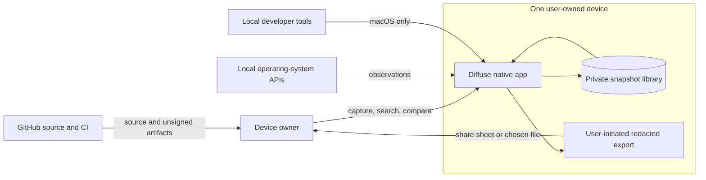

There is no Diffuse account, backend, telemetry service, cloud database, or sync protocol. GitHub hosts source code and CI artifacts; it is not a runtime backend.

## Two native implementation families

The repository contains five apps built from two independent runtime families:

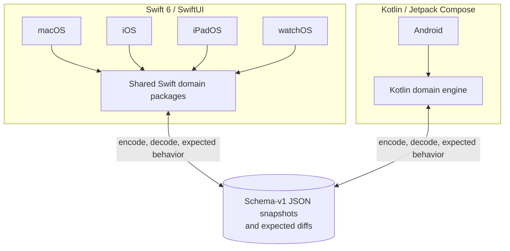

The boundary is intentional:

- Android does not compile, wrap, invoke, or modify the Swift app targets.
- Apple apps do not depend on Gradle, Kotlin, or Android artifacts.
- The shared contract is data and behavior: schema-v1 JSON, stable identifiers, privacy semantics, and golden expected diffs.
- Cross-platform compatibility is proved in tests, not by a shared binary framework.

This keeps every app native while preventing five subtly incompatible snapshot formats.

## Repository map

| Path | Responsibility |
| --- | --- |
| `Packages/` | First-party Swift domain engine and reusable SwiftUI components |
| `Apps/` | macOS, iOS, iPadOS, watchOS, widgets, and complications |
| `Android/` | Kotlin domain engine, collectors, Compose UI, WorkManager scheduling, tests |
| `Tools/` | Swift `diffuse-dev` CLI with no UI dependency |
| `Tests/` | Cross-package Swift domain, invariant, and integration suites |
| `Fixtures/` | Cross-language schema-v1 snapshots and expected diffs |
| `Documentation/` | Engineering guides and architecture decisions |
| `docs/screenshots/` | Live Apple and selected Android product screenshots used by public docs |
| `Scripts/` | Swift bootstrap, format, coverage, cross-check, and verification workflows |
| `.github/workflows/` | Separate Apple and Android CI pipelines plus site publishing |

## Apple package graph

Arrows point toward dependencies. Core packages do not import UIKit, AppKit, WatchKit, or WidgetKit.

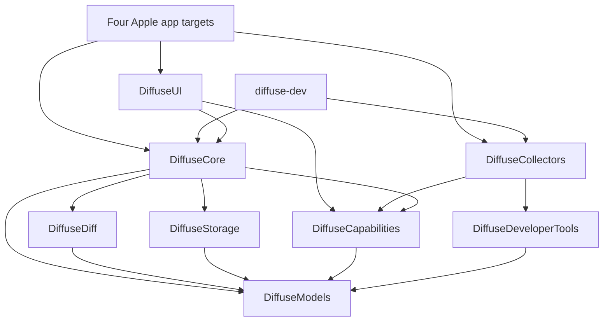

| Swift package | Owns |
| --- | --- |
| `DiffuseModels` | Snapshot vocabulary, schemas, values, privacy, versions, change types |
| `DiffuseDiff` | Pure schema-driven comparison, identity matching, severity, correlation |
| `DiffuseStorage` | JSON coding, file store, queries, validation, migration, retention planning |
| `DiffuseCapabilities` | Capability metadata, catalog, collector protocol, environment abstractions |
| `DiffuseCore` | Capture coordination, service facade, scheduling decisions, search, export, ledger |
| `DiffuseDeveloperTools` | Process runner and macOS developer-tool adapters |
| `DiffuseCollectors` | Platform-specific Apple observation APIs and registries |
| `DiffuseUI` | Generic SwiftUI renderers, design system, preferences, observable app model |

The four Apple apps share the engine and components, but each owns its root navigation and scheduling driver:

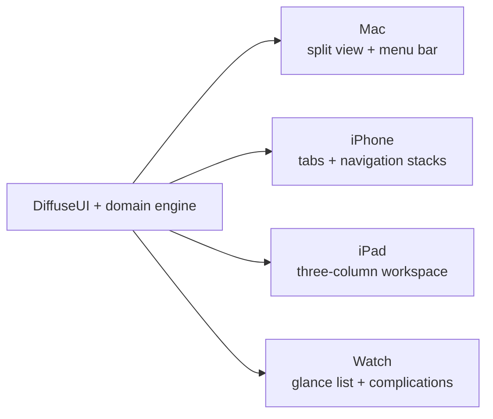

## Android component graph

Android mirrors product behavior in Kotlin without trying to mirror Swift file-for-file.

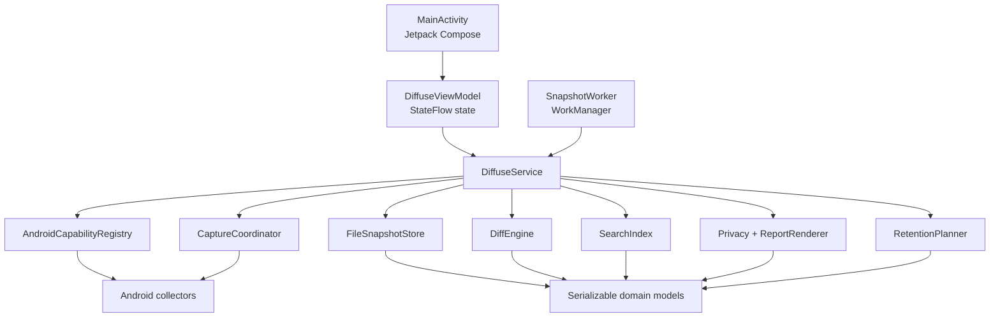

The main Android layers are:

- `domain/`: platform-free snapshot models, JSON coding, diff, privacy, retention, storage, search, and reports.
- `collectors/`: Android API access for device, system, battery, display, storage, connectivity, and interfaces.
- `core/`: service orchestration, deadlines, preferences, schedule decisions, and WorkManager entry points.
- `ui/`: lifecycle-aware `ViewModel`, immutable `DiffuseUiState`, theme, and Compose screens.

Android declares `ACCESS_NETWORK_STATE` but no `INTERNET` permission. Snapshot and preference paths are excluded from Android backup and device transfer rules.

## Snapshot as the compatibility contract

A snapshot carries both observations and the schema needed to interpret them later.

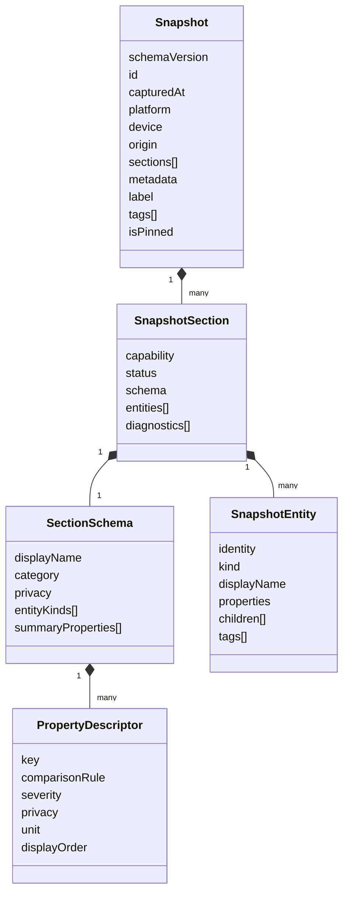

Important consequences:

1. A newer app can display an old or unknown capability because presentation metadata travels with the data.
2. The diff engine does not need branches such as `if capability == wifi`.
3. A schema change is a compatibility event; additive descriptors are preferred.
4. Stable capability, entity, property, and change identifiers make golden fixtures deterministic across Swift and Kotlin.

## Capture pipeline

Both implementations follow the same semantic sequence, even though their concrete types differ.

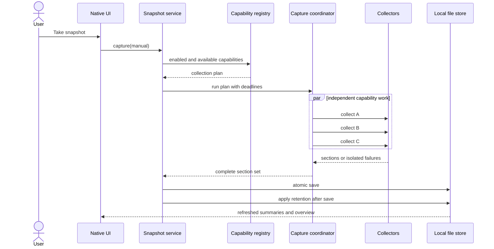

Collector failure is data, not an app-wide failure. A collector can report collected, skipped, unavailable, permission-required, failed, or timed-out status. The snapshot survives with diagnostics and every successful section intact.

## Diff pipeline

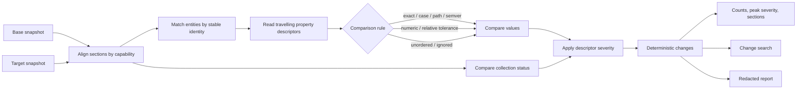

The schema owns comparison rules and privacy classification. The engine owns generic mechanics. Collectors never pre-compute a textual diff.

## Storage lifecycle

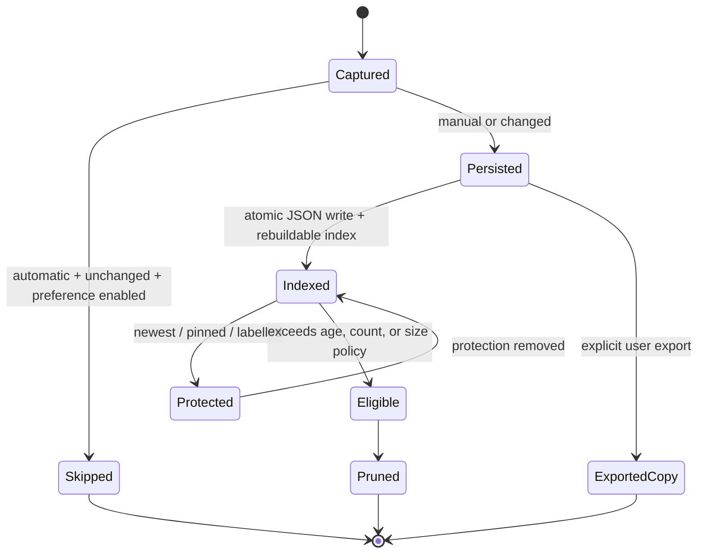

The newest snapshot is never pruned. Retention runs after a successful save. Index files are accelerators and can be rebuilt from snapshot envelopes.

## Privacy boundary

Collection and export deliberately use different policies: useful sensitive values remain available for local comparison, then are classified and redacted when the user shares.

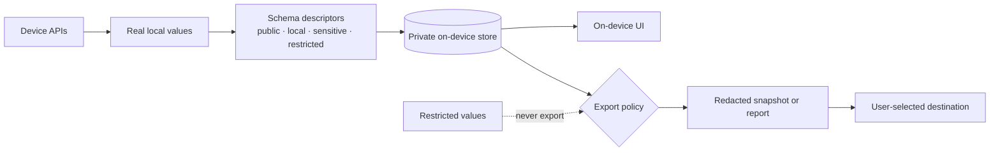

`restricted` values never export, including under the least restrictive policy. Redaction is not encryption and does not replace FileVault, device passcodes, or operating-system app isolation.

## Scheduling

Scheduling mechanisms are platform-native while product rules remain aligned.

| Platform | Driver | Product behavior |
| --- | --- | --- |
| macOS | Timer plus wake/unlock notifications | Cadence and system-event capture with a 15-minute floor |
| iOS / iPadOS | Background app refresh plus capture-on-open | Opportunistic, never presented as a daemon |
| watchOS | Watch application refresh task | Standalone scheduled glance updates |
| Android | WorkManager plus capture-on-open due check | Persistent periodic work within Android’s scheduling constraints |

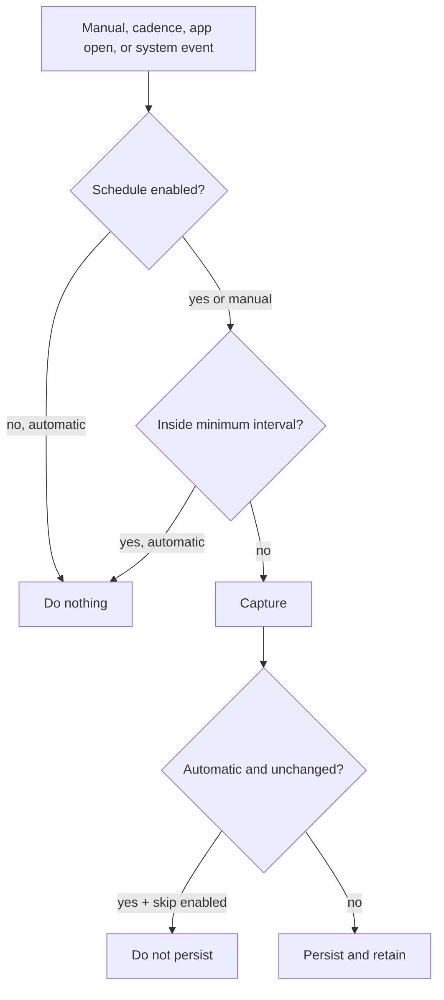

Manual capture always persists. Automatic skip-if-unchanged belongs in the service layer, not the scheduler.

## Native presentation architecture

Each app renders the same concepts using navigation appropriate to its device.

| App | Primary screens | Distinct behavior |
| --- | --- | --- |
| macOS | Overview, Snapshots, Compare, Capabilities, Privacy, Settings | Split view, menu bar extra, repo configuration, developer tools |
| iPhone | Overview, Snapshots, Compare, Settings, snapshot/entity detail | Tab view, navigation stacks, background refresh, widgets |
| iPad | Snapshots, Changes, Clusters/detail, settings/privacy/capability sheets | Persistent three-column analytical workspace |
| Watch | Glance, snapshot detail, change detail, settings | Standalone compact history and complications |
| Android | Overview, Snapshots/search, Compare, Settings/privacy, snapshot detail | Adaptive bottom navigation/navigation rail, Compose cards, WorkManager |

Reusable chip components are indivisible: their text remains on one line, while `ChipFlowLayout` on SwiftUI and `FlowRow` on Compose move complete chips to a new row at narrow widths.

## Cross-language verification

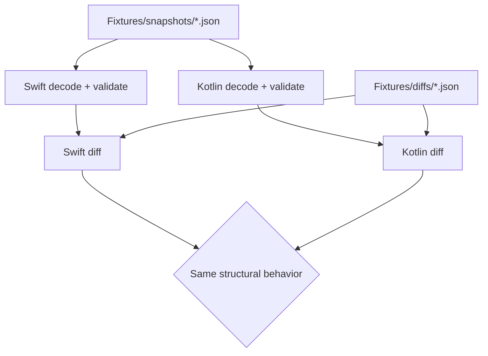

The test strategy has three layers:

- Pure domain suites pin comparison, privacy, storage, retention, scheduling, search, reporting, and serialization.
- Integration suites exercise capture → store → diff → search → export and cross-language fixtures.
- Native UI/instrumentation tests and live emulator review cover navigation, dialogs, adaptive layouts, and platform collectors.

Swift verification also type-checks shared packages against iOS and watchOS SDKs and builds all Apple targets unsigned. Android CI enforces Kotlin domain line coverage and builds unsigned debug/release artifacts.

## Extension rules

### Add an Apple capability

1. Define its typed section and travelling schema.
2. Implement a collector in `DiffuseCollectors`.
3. Register it only on platforms that can observe it.
4. Add fake-based and integration coverage.
5. Update fixtures only when the serialized contract genuinely changes.

Do not add capability-specific branches to UI, storage, export, search, or diff.

### Add an Android capability

1. Define explicit metadata and descriptors in the Android collector layer.
2. Implement platform reads in `collectors/`.
3. Register it in `AndroidCapabilityRegistry`.
4. Classify every property and add JVM plus device tests.
5. Confirm schema-v1 compatibility if the capability is shared conceptually with Apple.

### Add a comparison rule

A genuinely new comparison semantic must be implemented in both engines if it can appear in shared fixtures. Add direct behavior tests, reverse/self-diff invariants, and a golden case before using it in a collector.

## Capability matrix

Collectors register only where the hardware can actually observe the fact. A Watch never pretends to be a Mac.

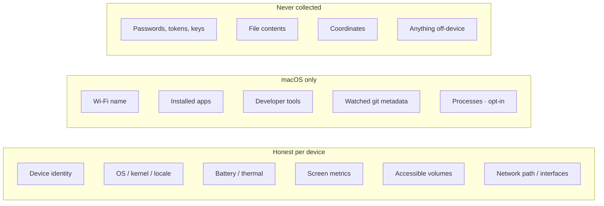

| Observation | macOS | iPhone / iPad | Watch | Android |
| --- | --- | --- | --- | --- |
| Device identity, OS version | yes | yes | yes | yes |
| Battery / power | yes | yes | yes | yes |
| Display metrics | yes | yes | size only | yes |
| Storage | all volumes | app container | container | app data volume |
| Network path / interfaces | yes | yes | path | connectivity + interfaces |
| Wi-Fi SSID | Location, sensitive | no | no | no |
| Installed applications | yes | no | no | no |
| Developer-tool versions | yes | no | no | no |
| Watched git metadata | yes | no | no | no |
| Process table | opt-in | no | no | no |
| Accounts, hardware IDs, file contents | never | never | never | never |

Adding Bun on Mac is a tool adapter. Adding Bluetooth peripherals is a new capability, a collector, a registry line, and tests — not a new screen.

## On-disk layout

Both engines persist pretty-printed JSON the owner can open in a text editor. Index files are accelerators and can be rebuilt.

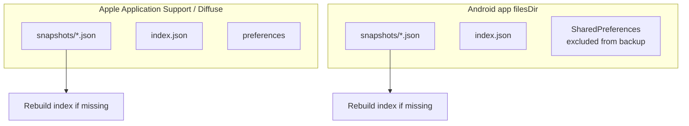

Apple path: `Application Support/Diffuse/` on that device. Android path: the app-private files directory; snapshots and preferences are excluded from Android backup and device transfer. Neither tree is an iCloud or Drive folder.

A snapshot file is an envelope around the snapshot object so unknown future fields round-trip. A bare snapshot without an envelope still decodes.

## Identity matching and change IDs

The diff engine never keys entities by array order.

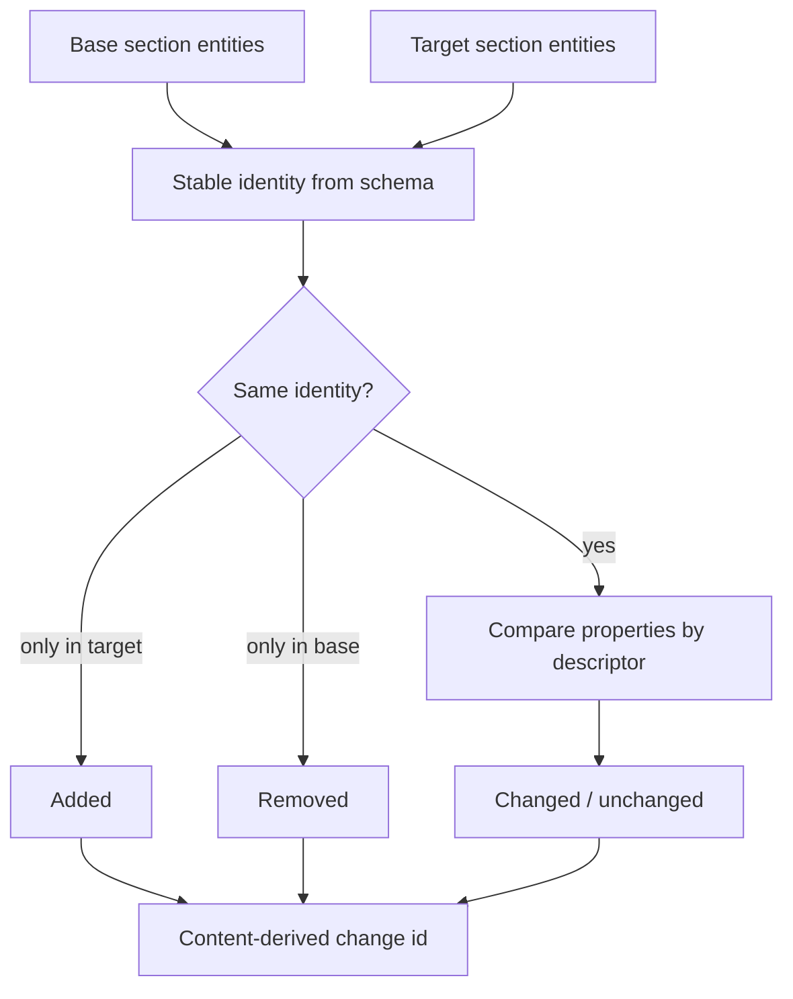

Change identifiers are hashes of capability, entity identity, property, and the compared values. Shuffling entity order does not change the set of change IDs. `diff(A, A)` is empty. Reversing a diff swaps additions and removals.

## Search

Library search and comparison search are different indexes over the same vocabulary.

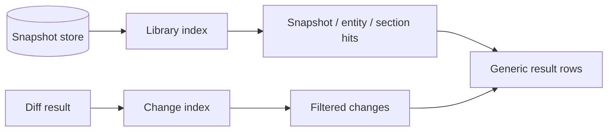

Empty-query change search is a no-op filter (show everything). Library search requires a term. Neither index stores file contents; they tokenize display names, identities, capability ids, and property labels that already live in the snapshot.

## Widgets and complications

Apple widgets never decode a snapshot. After a successful persist the host app writes a tiny summary into the app group.

```mermaid
sequenceDiagram
    participant App as Host app
    participant Store as Snapshot store
    participant Group as App group container
    participant Widget as Widget / complication

    App->>Store: persist snapshot
    Store-->>App: latest summary
    App->>Group: change-count.json
    Widget->>Group: read count + peak severity
    Note over Widget: unsigned CI has no container; widgets show empty
```

| Surface | Group |
| --- | --- |
| iOS widgets | `group.com.diffuse.ios` |
| iPadOS widgets | `group.com.diffuse.ipados` |
| watchOS complications | `group.com.diffuse.watch` |

## Export and import

Export is a user action. Import is a file the user picked. Neither is sync.

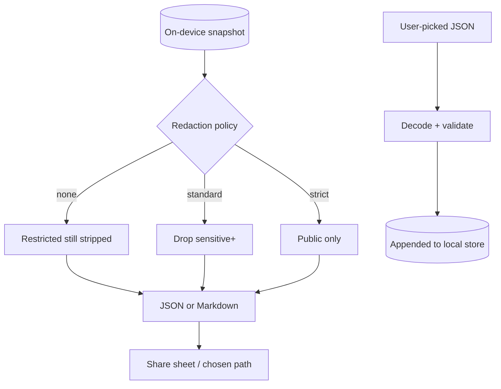

Android uses the system document picker and share sheet. Apple uses `fileImporter` / `ShareLink`. `restricted` values never appear in either format.

## Test pyramid

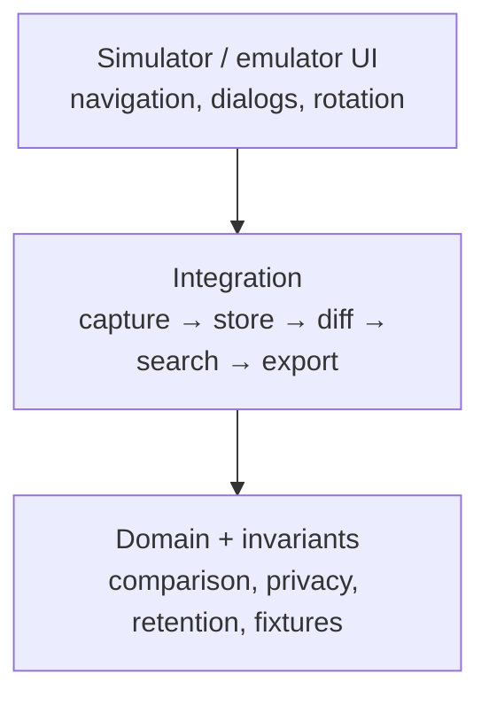

Cross-language proof lives at the domain layer: Kotlin decodes Swift golden snapshots and structurally matches expected diffs. UI tests do not redefine comparison rules.

| Layer | Apple | Android |
| --- | --- | --- |
| Domain | Swift Testing, ~445 tests | JUnit + coroutine test, JaCoCo 90% domain floor |
| Fixtures | `Fixtures/snapshots` + `Fixtures/diffs` | The same files, decoded in Kotlin |
| Device | Unsigned simulator builds | Compose instrumentation on emulator |
| Static | SwiftFormat + SDK cross-check | Android Lint + R8 on release |

## CI topology

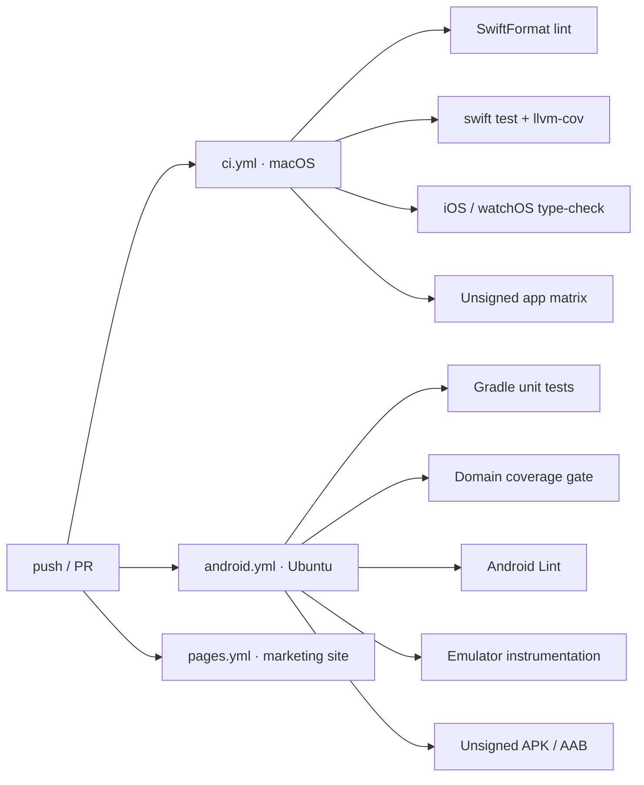

Pages deploys only `index.html`, `404.html`, `web/`, and the small SEO files — never the Swift or Android trees. Signing identities are not present in any workflow.

## Failure isolation

A collector is allowed to fail. The snapshot is not.

```mermaid
stateDiagram-v2
    [*] --> Collecting
    Collecting --> Collected: success
    Collecting --> Skipped: disabled
    Collecting --> Unavailable: hardware missing
    Collecting --> PermissionRequired: OS denied
    Collecting --> Failed: thrown error
    Collecting --> TimedOut: deadline
    Collected --> Snapshot
    Skipped --> Snapshot
    Unavailable --> Snapshot
    PermissionRequired --> Snapshot
    Failed --> Snapshot
    TimedOut --> Snapshot
```

Diagnostics travel with the section. The UI renders status; it does not crash the library.

## Architectural invariants

- Snapshots never leave a device without a user-initiated export.
- There is no account, cloud sync, telemetry, or snapshot upload.
- Apple and Android runtime code remain independent.
- Schema-v1 JSON and golden diffs remain interoperable.
- Every observed property is explicitly classified for privacy.
- Restricted values never export.
- Collector failures remain isolated to their sections.
- The newest snapshot survives retention.
- App screens render generic schemas and changes, not capability IDs.
- Apple core packages remain free of platform UI imports.
- Signing identities, provisioning profiles, and keystores stay outside the repository.
- Android ships without the `INTERNET` permission.

## Further reading

- [Documentation/Architecture.md](Documentation/Architecture.md) — Swift package details and capture internals
- [Documentation/Apps.md](Documentation/Apps.md) — navigation, scheduling, widgets, and screenshots
- [Android/README.md](Android/README.md) — Android build and test guide
- [Documentation/SnapshotSchema.md](Documentation/SnapshotSchema.md) — serialized contract
- [Documentation/Privacy.md](Documentation/Privacy.md) — classification, redaction, and threat model
- [Documentation/Testing.md](Documentation/Testing.md) — suite placement and verification
- [Documentation/adr/](Documentation/adr/) — append-only decision record
