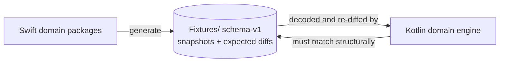
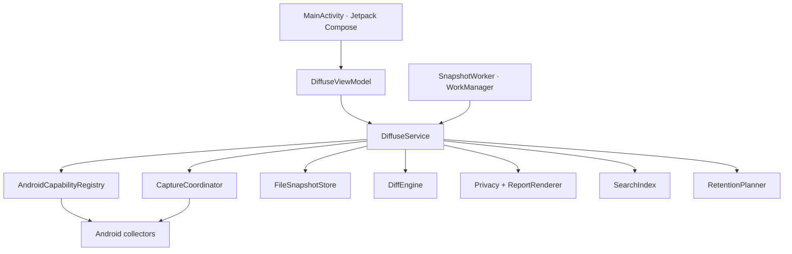

# Diffuse for Android

A fully native Kotlin and Jetpack Compose implementation of Diffuse. It shares no runtime code with the Apple apps; compatibility is enforced through the repository's schema-v1 JSON snapshots and golden diff fixtures ([ADR 0009](../Documentation/adr/0009-native-android.md)).

Contract for contributors and agents: [AGENTS.md](AGENTS.md). Product behaviour across all five apps: [Documentation/Apps.md](../Documentation/Apps.md). Whole-repository map: [ARCHITECTURE.md](../ARCHITECTURE.md).

## Why a second engine instead of shared code

Kotlin/Native, a Swift-to-Kotlin bridge, or a cross-platform UI toolkit would each buy code reuse at the cost of the thing that makes Diffuse defensible: a genuinely native app on every platform, with no runtime it does not control. So the Kotlin engine is a re-implementation, and the *contract* is the artifact both sides must honour — schema-v1 JSON, and the golden diffs under `Fixtures/`.

That contract is executable. `FixtureCompatibilityTest` decodes Swift-generated snapshots in Kotlin and asserts that the Kotlin `DiffEngine` produces structurally identical results. If the two implementations drift, the Android build fails.



## Product guarantees

- Local-only snapshots under the app's private files directory (`filesDir/diffuse/snapshots/`).
- No account, cloud, telemetry, analytics, advertising identifier, or hardware identifier.
- **No `INTERNET` permission.** The manifest declares exactly one permission: `ACCESS_NETWORK_STATE`.
- Android cloud backup and device transfer explicitly exclude snapshots and preferences (`res/xml/backup_rules.xml`, `res/xml/data_extraction_rules.xml`).
- Export is user-initiated and classification-driven. `restricted` values are always redacted, including under `RedactionPolicy.NONE`.
- Release signing material is never stored in the repository.

## Capabilities

What Android observes:

| Capability | Fields |
| --- | --- |
| Device | Model, manufacturer, Android/API version, supported ABIs, device name |
| System | Kernel, uptime and boot time, locale, time zone, memory, thermal and Battery Saver state |
| Battery | Level, state, health, temperature |
| Display | Resolution, density, refresh ceiling |
| Storage | App-accessible data-volume capacity and free space |
| Connectivity | Active transport, VPN / metered / validated state |
| Network interfaces | Non-loopback interfaces and their local addresses |

What it deliberately does **not** observe: accounts, installed-app inventory, process tables, Wi-Fi scans or SSID, precise location, hardware identifiers, and file names or contents. Every field carries an explicit privacy classification in its descriptor, and the in-app privacy ledger is generated from that metadata rather than hand-written.

## Source layout

```
Android/
├── build.gradle.kts             AGP 8.10.1, Kotlin 2.0.21, Compose + serialization plugins
├── settings.gradle.kts          FAIL_ON_PROJECT_REPOS; google() + mavenCentral()
├── gradle.properties            configuration cache, parallel, AndroidX
└── app/
    ├── build.gradle.kts         SDK 36 / min 26, JVM 17, JaCoCo rules, fixtures system property
    ├── proguard-rules.pro       R8 keep rules for release
    └── src/
        ├── main/java/com/diffuse/android/
        │   ├── MainActivity.kt          Compose UI, adaptive navigation, every screen
        │   ├── DiffuseApplication.kt    Schedules periodic work at process start
        │   ├── ui/                      DiffuseViewModel (StateFlow), Theme
        │   ├── core/                    DiffuseService, CaptureCoordinator, SnapshotWorker, AndroidPreferences
        │   ├── collectors/              The only place platform observation APIs may appear
        │   └── domain/                  Models, DiffEngine, Privacy, Storage, SearchAndReports
        ├── test/                        JVM domain suite (JUnit + coroutines-test)
        └── androidTest/                 Collectors, preferences, service, Compose instrumentation
```

`domain/` is pure Kotlin: no `android.*` import, no `Context`. That is what makes it testable on the JVM and what the JaCoCo rule measures.

## Architecture



### Capture

`DiffuseService.capture` filters the registry by the user's capability toggles, wraps each enabled collector in a `PlannedCollector`, and hands the list to `CaptureCoordinator`. The coordinator fans out under a `supervisorScope` with per-collector deadlines, so one hanging or throwing capability becomes a section status and a diagnostic instead of a failed snapshot. Disabled capabilities still produce placeholder sections, which is why the privacy ledger and the UI can be honest about what was skipped.

### Storage

`FileSnapshotStore` writes one pretty-printed JSON file per snapshot under `filesDir/diffuse/snapshots/`, guarded by a process-wide `Mutex` and written atomically. Saves refuse to overwrite an existing ID. There is no database. Retention runs after each save and never deletes the newest snapshot.

### UI state

`DiffuseViewModel` exposes a single immutable `StateFlow` of UI state and delegates all domain work to `DiffuseService`. Compose collects it with `collectAsStateWithLifecycle`. Navigation is adaptive: a bottom bar below 720dp, a navigation rail at and above it. Primary destinations are Overview, Snapshots, Compare, and Settings; snapshot detail, search, the privacy ledger, import, export/share, and destructive confirmations are separate native surfaces.

### Scheduling

`DiffuseApplication` enqueues periodic work at process start; `SnapshotWorker` is a `CoroutineWorker`. The app-open path independently checks whether a capture is due, so the app is useful even when the OS defers background work. Defaults match the Apple apps: every four hours, a 15-minute floor for automatic captures, skip-if-unchanged on automatic captures, and 90 days / 1 GiB retention with the newest snapshot always protected.

## Build and test

Requirements: JDK 17, Android SDK 36, and an emulator or device for instrumented UI tests.

```bash
cd Android

./gradlew testDebugUnitTest                          # JVM domain suite
./gradlew jacocoDebugUnitTestReport                  # HTML + XML coverage
./gradlew jacocoDebugUnitTestCoverageVerification    # 90% floor on domain
./gradlew connectedDebugAndroidTest                  # emulator/device suite
./gradlew lintDebug                                  # Android Lint
./gradlew assembleDebug                              # app/build/outputs/apk/debug/
./gradlew assembleRelease                            # unsigned, R8-shrunk
./gradlew bundleRelease                              # unsigned AAB
```

The coverage report lands at `app/build/reports/jacoco/jacocoDebugUnitTestReport/html/index.html`, with machine-readable XML beside it. CI enforces at least 90% line coverage for `com.diffuse.android.domain`; Android framework and Compose behaviour are covered by connected emulator tests rather than by inflating the JVM number with mocks.

If Gradle cannot find the SDK, create the gitignored `Android/local.properties`:

```properties
sdk.dir=/Users/you/Library/Android/sdk
```

More failure modes: [Documentation/Troubleshooting.md](../Documentation/Troubleshooting.md).

### Test suites

| Layer | Path | Covers |
| --- | --- | --- |
| Kotlin / JVM | `app/src/test/` | Models, JSON, diff, privacy, storage, retention, search, reports, scheduling, coordinator |
| Fixture contract | `FixtureCompatibilityTest` | Decoding Swift snapshots and matching expected structural diffs |
| Instrumentation | `app/src/androidTest/` | Collectors, preferences, service/storage, Compose navigation, dialogs, rotation, adaptive layout |

The JVM suite resolves fixtures through the `diffuse.fixtures` system property, set in `app/build.gradle.kts` to `rootProject.file("../Fixtures")`. It therefore only works with `Android/` inside this repository — the cross-language contract is the point.

## Dependencies

Every dependency is Google's own AndroidX or JetBrains' Kotlin libraries. There is no analytics SDK, crash reporter, DI framework, image loader, or networking client.

| Dependency | Version |
| --- | --- |
| Compose BOM | `2024.12.01` |
| `androidx.activity:activity-compose` | 1.13.0 |
| `androidx.compose.material3` / `foundation` / `ui` / `material-icons-extended` | via BOM |
| `androidx.lifecycle:*-compose`, `lifecycle-viewmodel-ktx` | 2.10.0 |
| `androidx.work:work-runtime-ktx` | 2.11.2 |
| `kotlinx-coroutines-android` | 1.9.0 |
| `kotlinx-serialization-json` | 1.7.3 |
| `junit:junit` | 4.13.2 |
| `kotlinx-coroutines-test` | 1.9.0 |
| `androidx.test.ext:junit` | 1.3.0 |
| `androidx.test.espresso:espresso-core` | 3.7.0 |
| JaCoCo | 0.8.12 |

## CI

[`.github/workflows/android.yml`](../.github/workflows/android.yml) runs on changes to `Android/**`, `Fixtures/**`, or the workflow itself. Two jobs on `ubuntu-latest` with Temurin 17:

1. **test-and-build** — JVM tests, JaCoCo report, JaCoCo verification, `assembleDebugAndroidTest`, `lintDebug`, `assembleRelease`. Uploads the coverage report and the unsigned APK for 14 days.
2. **instrumented-tests** — creates a Pixel 6 `android-34` `google_apis;x86_64` AVD, waits for `sys.boot_completed`, and runs `connectedDebugAndroidTest`.

It is intentionally separate from the Xcode matrix in `ci.yml`. Release packaging: [Documentation/Releasing.md](../Documentation/Releasing.md).

## Screenshots

The curated, versioned gallery for every platform — Android included — lives in [docs/screenshots/](../docs/screenshots/) as `android-*.png`. Raw emulator verification passes are written to `Android/screenshots/`, which is gitignored on purpose. Skill: `screenshots`.

## Rules

- Platform observation APIs belong in `collectors/` and nowhere else.
- Every collected property needs an explicit privacy classification in its descriptor.
- `domain/` stays free of `android.*` imports.
- Never weaken a fixture to make a Kotlin test pass.
- No new permission without an ADR. `INTERNET` is not on the table.
- Keystores, signing configs, and `local.properties` stay outside version control.
