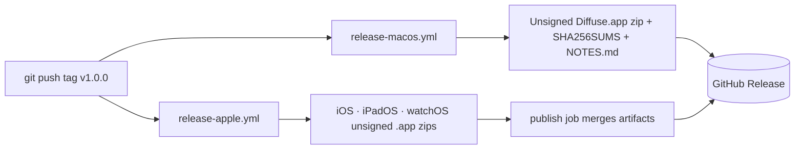

# Releasing

Diffuse releases are **unsigned build artifacts**, not store submissions. No developer-account secret exists in this repository, and none should ([ADR 0005](adr/0005-generated-unsigned.md)). Whoever distributes Diffuse signs and notarizes outside this checkout.

Skill: `release`. Scripts and CI map: [Repository.md](Repository.md).

## What a release contains

| Artifact | Produced by | Contents |
| --- | --- | --- |
| `Diffuse-macOS-v<version>.zip` | `.github/workflows/release-macos.yml` | Unsigned `Diffuse.app`, `ditto`-archived |
| `Diffuse-ios-v<version>.zip` | `.github/workflows/release-apple.yml` | Unsigned iOS `.app` |
| `Diffuse-ipados-v<version>.zip` | `.github/workflows/release-apple.yml` | Unsigned iPadOS `.app` |
| `Diffuse-watchos-v<version>.zip` | `.github/workflows/release-apple.yml` | Unsigned watchOS `.app` |
| `SHA256SUMS` | both workflows | `shasum -a 256` over every zip |
| Release notes | `release-macos.yml` | The newest `## ` section of `CHANGELOG.md`, plus generated notes |

Both workflows trigger on `push` of a tag matching `v*` and need only `contents: write`.



## Version numbers

`VERSION` at the repository root is the only place a human edits. Everything
else is derived, and CI fails when they disagree — they drifted once already,
with v1.1.0 shipped while every file in the tree still said 1.0.0.

| Derived from `VERSION` | Field |
| --- | --- |
| `Android/app/build.gradle.kts` | `versionName`, and `versionCode` as `MAJOR*10000 + MINOR*100 + PATCH` |
| `project.yml` | `MARKETING_VERSION` |
| `index.html` | `softwareVersion` in the structured data |
| `CITATION.cff` | `version` and `date-released` |

```bash
Scripts/version.sh              # what is it now
Scripts/version.sh check        # do all five agree (this is what CI runs)
Scripts/version.sh sync         # rewrite the derived files
Scripts/version.sh bump minor   # patch | minor | major, then sync
```

`CHANGELOG.md` keeps an `## Unreleased` heading. Cutting a release renames it to
`## <version> — <date>` and opens a fresh `## Unreleased` above it. The macOS
workflow extracts the first `## ` section into the release body, so a stale
`Unreleased` heading would ship as the notes.

## Cutting a release

Run the **Release** workflow from the Actions tab and choose `patch`, `minor` or
`major`. It refuses to start if the tree's versions disagree, refuses to reuse
an existing tag, then bumps `VERSION`, propagates it, opens the changelog
section, commits, tags, and pushes.

The tag alone does not start anything. GitHub suppresses workflow triggers from
events raised by the default `GITHUB_TOKEN`, so a tag pushed by a workflow is
inert — the first cut of v1.1.2 pushed a tag and built nothing. The Release
workflow therefore dispatches `release-apple`, `release-macos` and
`release-android` explicitly, at the new tag, and fails if any of them cannot be
started. Those three still build the artifacts and publish the GitHub Release,
exactly as before.

A tag pushed by hand from a laptop does trigger them, because that is a real
user's push rather than the token's.

Dispatching happens **at the tag**, because the Apple and macOS workflows take
their version from the ref they run on. Two consequences worth knowing:

- A tag created before `workflow_dispatch` was added to those workflows cannot
  be dispatched at all — the trigger is read from the file at that ref. Push
  such a tag by hand instead.
- `release-android` does not read the ref; it takes the tag as a required
  input. Omitting it fails with `Required input 'tag' not provided`.

The cut does not finish when the tag is pushed. It waits for the three builds,
then checks that a GitHub Release actually exists for the tag with files
attached, and fails if it does not. This job once reported success having
produced nothing at all, which is worse than failing, because nobody goes
looking at a green run.

`dry_run` works everything out and reports it in the job summary without
tagging or pushing — use it to see what the next version would be.

By hand, if you prefer:

```bash
Scripts/version.sh bump minor
git commit -am "Release v$(Scripts/version.sh)"
git tag -a "v$(Scripts/version.sh)" -m "Diffuse $(Scripts/version.sh)"
git push origin HEAD "v$(Scripts/version.sh)"
```

## Checklist

```bash
./Scripts/verify.sh                     # format lint, swift test, cross-check, unsigned builds
cd Android && ./gradlew testDebugUnitTest jacocoDebugUnitTestCoverageVerification lintDebug assembleRelease
```

1. `./Scripts/verify.sh` prints `Diffuse is healthy.`
2. The Android gate above is green.
3. Golden fixtures under `Fixtures/` are unchanged, or the diff is explained in the changelog.
4. `docs/screenshots/` matches the shipping UI — `Scripts/capture-*-screenshots.sh` — and the capture date in the README is current.
5. `Scripts/version.sh check` passes.
6. No signing material anywhere: `git grep -nE 'PROVISIONING_PROFILE|DEVELOPMENT_TEAM|CODE_SIGN_IDENTITY *= *"[^-]'` returns nothing meaningful.

## After the tag

- Watch both release workflows. They are independent; one can succeed while the other fails.
- Verify the checksums attached to the release match the zips you downloaded.
- The Pages workflow redeploys the marketing site on every push to the default branch, not on tags. If a release changes the site copy, that ships separately.

## Installing an unsigned build

macOS refuses to open an unsigned, unnotarized app from a browser download. That is Gatekeeper working correctly, not a bug in the artifact.

```bash
xattr -dr com.apple.quarantine /Applications/Diffuse.app
```

iOS, iPadOS, and watchOS zips are **simulator- and development-oriented artifacts**. They cannot be installed on a device without re-signing. Widgets and complications are empty in unsigned builds because the app-group container is unavailable — expected, and covered in [SUPPORT.md](../SUPPORT.md).

## Android

The Android workflow uploads an unsigned release APK and the JaCoCo report as **CI artifacts** on every qualifying push, with a 14-day retention. There is no tag-triggered Android release workflow yet, so Android builds are not attached to GitHub Releases alongside the Apple zips. Producing an Android release today means downloading the `diffuse-android-unsigned` artifact from the Android workflow run, or building locally:

```bash
cd Android
./gradlew assembleRelease   # app/build/outputs/apk/release/
./gradlew bundleRelease     # app/build/outputs/bundle/release/
```

Both are unsigned. `isMinifyEnabled = true` means R8 and `app/proguard-rules.pro` apply. Signing configuration and keystores stay outside this repository; `.gitignore` refuses `*.jks`, `*.keystore`, and `keystore.properties` as a safety net.

## What is deliberately not automated

- **Signing and notarization.** No `DEVELOPMENT_TEAM`, no provisioning profile, no App Store Connect key, no keystore.
- **Store submission.** No Fastlane lane, no `altool`, no Play Console upload.
- **Version bumping.** No `semantic-release`. The changelog is written by a person who knows what changed.
- **Dependency updates for Swift.** There are none to update ([ADR 0004](adr/0004-no-third-party-deps.md)).
