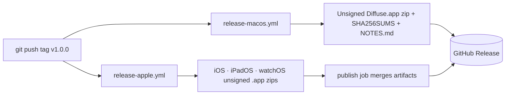

# Releasing

Diffuse releases are **unsigned build artifacts**, not store submissions. No developer-account secret exists in this repository, and none should ([ADR 0005](adr/0005-generated-unsigned.md)). Whoever distributes Diffuse signs and notarizes outside this checkout.

Skill: `release`. Scripts and CI map: [Repository.md](Repository.md).

## What a release contains

| Artifact | Produced by | Contents |
| --- | --- | --- |
| `Diffuse-macOS-v<version>.zip` | `.github/workflows/release-macos.yml` | Unsigned `Diffuse.app`, `ditto`-archived |
| `Diffuse-ios-v<version>.zip` | `.github/workflows/release-apple.yml` | Unsigned iOS `.app` |
| `Diffuse-ipados-v<version>.zip` | `.github/workflows/release-apple.yml` | Unsigned iPadOS `.app` |
| `Diffuse-watchos-v<version>.zip` | `.github/workflows/release-apple.yml` | Unsigned watchOS `.app` |
| `SHA256SUMS` | both workflows | `shasum -a 256` over every zip |
| Release notes | `release-macos.yml` | The newest `## ` section of `CHANGELOG.md`, plus generated notes |

Both workflows trigger on `push` of a tag matching `v*` and need only `contents: write`.



## Version numbers

Three places carry a version. Keep them equal before tagging.

| Place | Field |
| --- | --- |
| `project.yml` | `MARKETING_VERSION` (and bump `CURRENT_PROJECT_VERSION`) |
| `Android/app/build.gradle.kts` | `versionName`, and increment `versionCode` |
| `CITATION.cff` | `version` and `date-released` |

`CHANGELOG.md` keeps an `## Unreleased` heading. Releasing renames it to `## <version> — <date>` and opens a fresh `## Unreleased` above it. The macOS workflow extracts the first `## ` section into the release body, so a stale `Unreleased` heading will ship as the notes.

## Checklist

```bash
./Scripts/verify.sh                     # format lint, swift test, cross-check, unsigned builds
cd Android && ./gradlew testDebugUnitTest jacocoDebugUnitTestCoverageVerification lintDebug assembleRelease
```

1. `./Scripts/verify.sh` prints `Diffuse is healthy.`
2. The Android gate above is green.
3. Golden fixtures under `Fixtures/` are unchanged, or the diff is explained in the changelog.
4. `docs/screenshots/` matches the shipping UI (skill `screenshots`), and the capture date in the README is current.
5. Versions above agree; `CHANGELOG.md` has a dated section.
6. No signing material anywhere: `git grep -nE 'PROVISIONING_PROFILE|DEVELOPMENT_TEAM|CODE_SIGN_IDENTITY *= *"[^-]'` returns nothing meaningful.

Then:

```bash
git tag -a v1.0.0 -m "Diffuse 1.0.0"
git push origin v1.0.0
```

## After the tag

- Watch both release workflows. They are independent; one can succeed while the other fails.
- Verify the checksums attached to the release match the zips you downloaded.
- The Pages workflow redeploys the marketing site on every push to the default branch, not on tags. If a release changes the site copy, that ships separately.

## Installing an unsigned build

macOS refuses to open an unsigned, unnotarized app from a browser download. That is Gatekeeper working correctly, not a bug in the artifact.

```bash
xattr -dr com.apple.quarantine /Applications/Diffuse.app
```

iOS, iPadOS, and watchOS zips are **simulator- and development-oriented artifacts**. They cannot be installed on a device without re-signing. Widgets and complications are empty in unsigned builds because the app-group container is unavailable — expected, and covered in [SUPPORT.md](../SUPPORT.md).

## Android

The Android workflow uploads an unsigned release APK and the JaCoCo report as **CI artifacts** on every qualifying push, with a 14-day retention. There is no tag-triggered Android release workflow yet, so Android builds are not attached to GitHub Releases alongside the Apple zips. Producing an Android release today means downloading the `diffuse-android-unsigned` artifact from the Android workflow run, or building locally:

```bash
cd Android
./gradlew assembleRelease   # app/build/outputs/apk/release/
./gradlew bundleRelease     # app/build/outputs/bundle/release/
```

Both are unsigned. `isMinifyEnabled = true` means R8 and `app/proguard-rules.pro` apply. Signing configuration and keystores stay outside this repository; `.gitignore` refuses `*.jks`, `*.keystore`, and `keystore.properties` as a safety net.

## What is deliberately not automated

- **Signing and notarization.** No `DEVELOPMENT_TEAM`, no provisioning profile, no App Store Connect key, no keystore.
- **Store submission.** No Fastlane lane, no `altool`, no Play Console upload.
- **Version bumping.** No `semantic-release`. The changelog is written by a person who knows what changed.
- **Dependency updates for Swift.** There are none to update ([ADR 0004](adr/0004-no-third-party-deps.md)).
