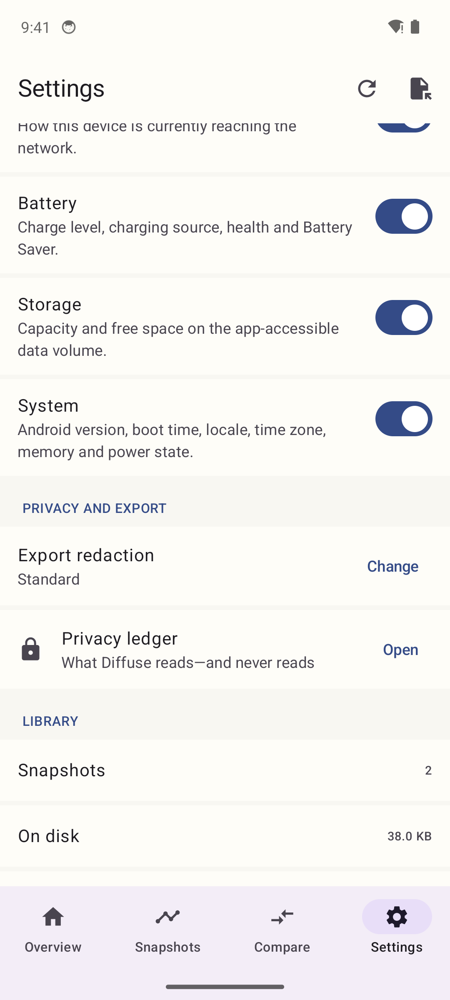
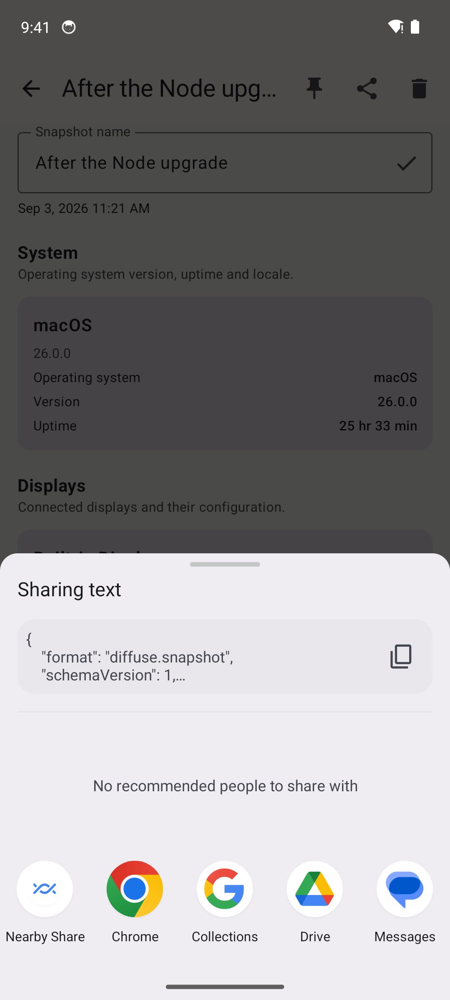
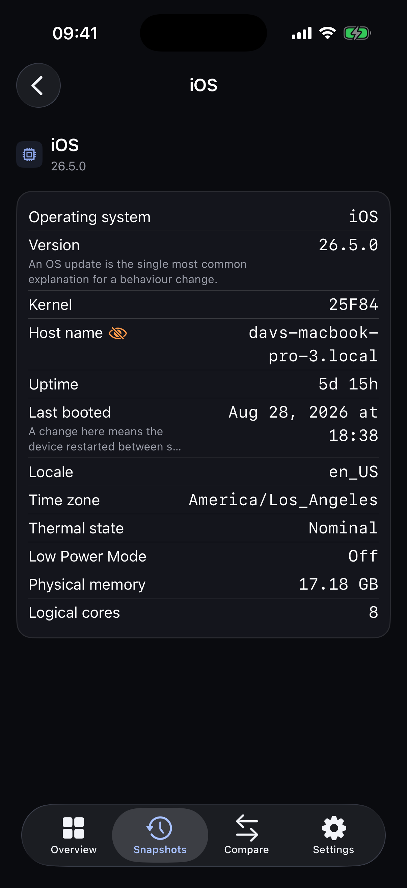
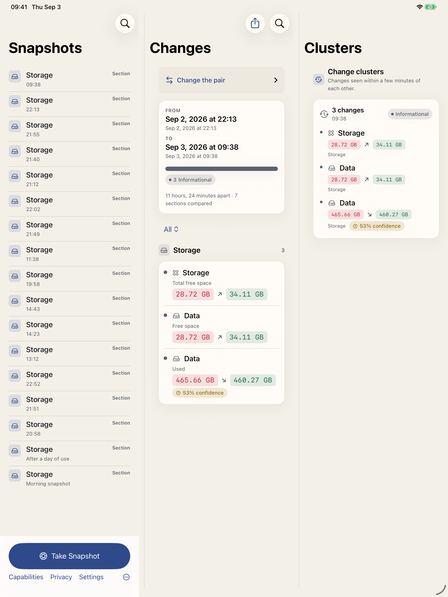
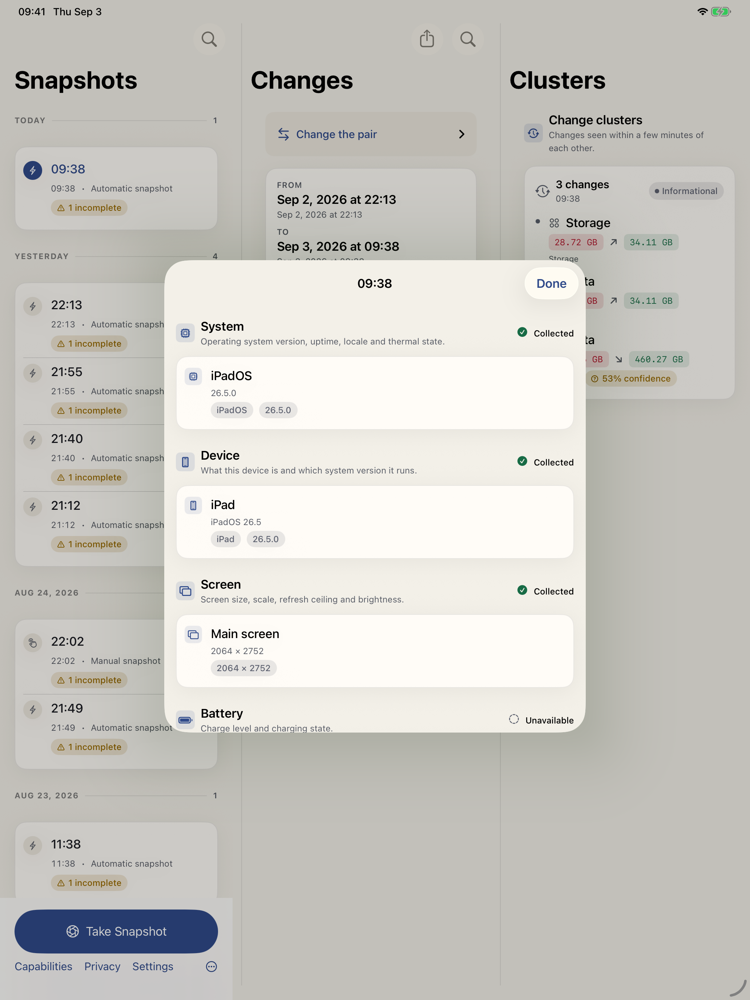
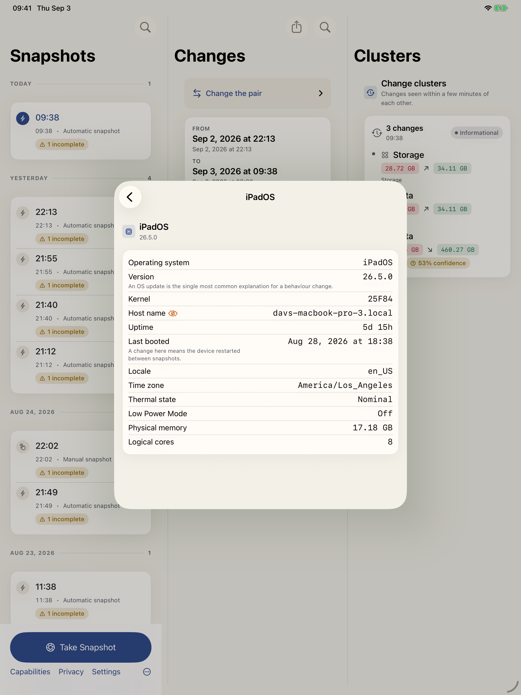
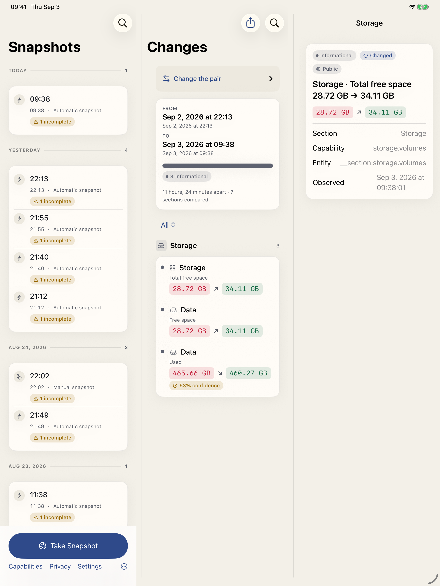
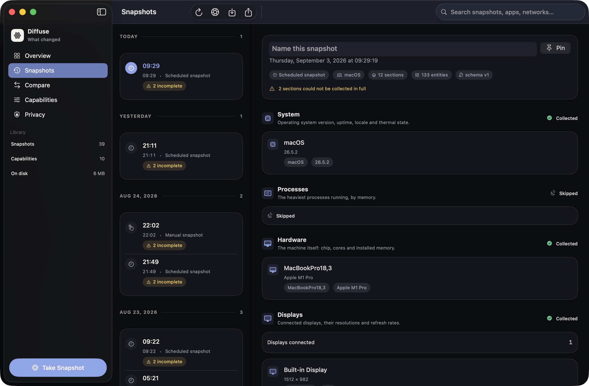
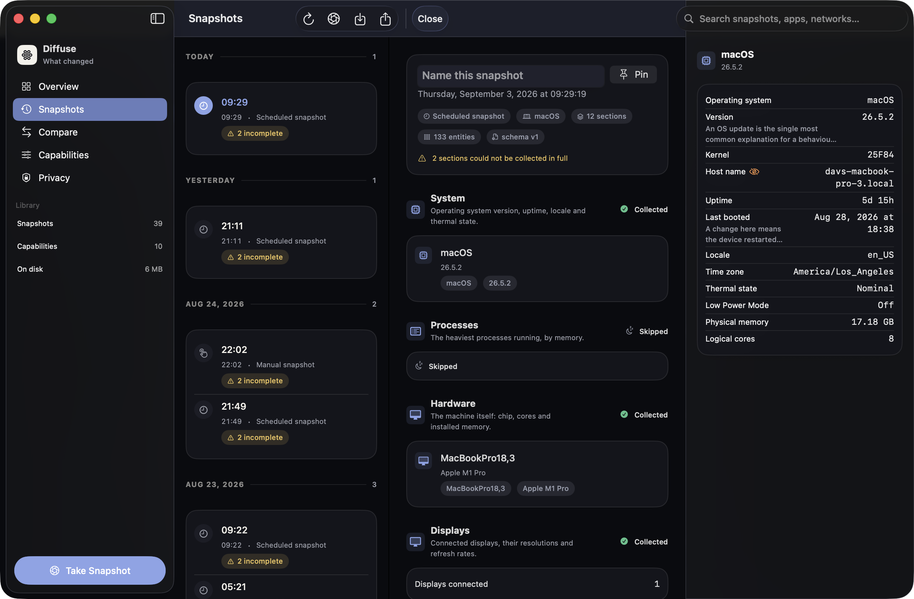
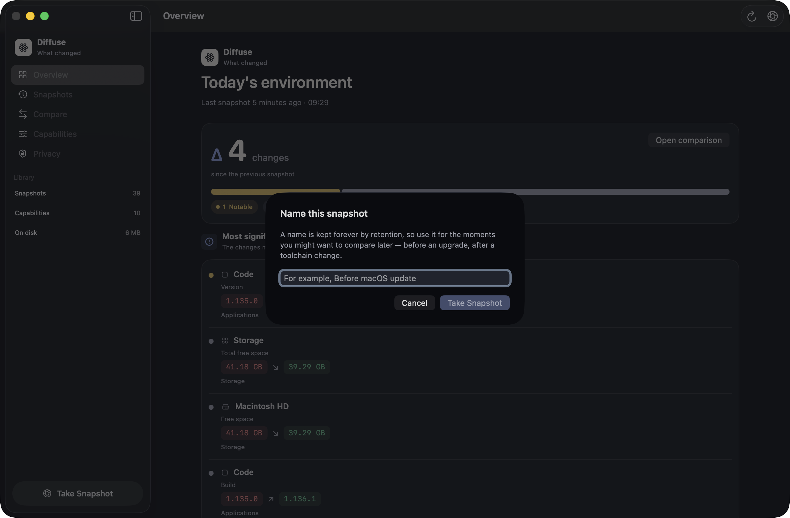

# Screenshots

Taken from the running native apps. The whole set was retaken on **3 Sep 2026**, after the comparison screens gained an in-place snapshot picker, the snapshot lists lost their comparison selection, and the timeline day headings were restyled. Replace these PNGs from the live apps when UI changes. Do not invent marketing images. Skill: `screenshots`. App icons are a different pipeline: [Design/Icons/README.md](../../Design/Icons/README.md).

The iPhone shots are full-device framebuffers (1206×2622). A missing launch screen previously letterboxed the UI to a 320×480 compatibility size; that is fixed.

`landing-*.png` at the repository root are local Playwright QA captures of the marketing site, and `Android/screenshots/` holds raw emulator verification passes. Both are gitignored on purpose and are not product screenshots — do not check them in. This directory is the only versioned gallery.

## How they were taken

Three scripts, one per toolchain. They exist because doing this by hand is how
the gallery drifts: a phone home screen shipped as `android-search.png` for a
fortnight because a capture was taken while the app was in the background.

```bash
Scripts/capture-macos-screenshots.sh              # all nine, or one by name
Scripts/capture-simulator-screenshots.sh          # iPhone, iPad, Watch
Scripts/capture-simulator-screenshots.sh ios compare
Scripts/capture-android-screenshots.sh            # all eighteen, or one by name
python3 Scripts/build-web-media.py                # derive web/media/*.jpg
```

What they guard against, all of it learned the hard way:

- **A blank capture is not an error.** `screencapture` returns a black PNG when
  Screen Recording is denied, and writing that over a good screenshot loses it
  silently. Every shot lands in a temporary file and is checked for colour
  variance before it replaces anything.
- **Granting Screen Recording to the debug app does not stick.** Debug builds
  are ad-hoc signed and get a fresh identity on each rebuild, so the grant stops
  matching. The macOS script captures from the terminal, which already holds the
  permission, and only asks the app to switch screens.
- **A failed navigation still photographs something.** Android captures are
  gated on arriving: if the tap target is missing, the script fails rather than
  shooting whatever is in front, and refuses outright when Diffuse is not the
  foreground app.
- **An idle emulator has nothing to diff.** The Android library is seeded from
  `Fixtures/` and the app's own capture-on-open is pruned, so the comparison
  screens show real changes instead of "Nothing changed" — and so reruns produce
  the same images.
- **`simctl launch` needs `SIMCTL_CHILD_`.** Anything else on the command line
  arrives as argv and is ignored.

macOS captures use the real library in `Application Support/Diffuse/`; seed it
from `Fixtures/snapshots/` if the UI would otherwise look empty.

`DIFFUSE_SCREENSHOT` values the apps honour:

| App | Values |
| --- | --- |
| Mac | `overview`, `snapshots`, `compare`, `capabilities`, `privacy`, `search`, `snapshot-detail`, `entity-detail`, `named-snapshot` |
| iPhone | `overview`, `timeline`, `compare`, `settings`, `capabilities`, `privacy`, `search`, `snapshot-detail`, `entity-detail` |
| iPad | workspace (default), `privacy`, `capabilities`, `settings`, `search`, `snapshot-detail`, `entity-detail`, `change-detail` |
| Watch | glance (default), `settings`, `snapshot-detail`, `change-detail` |

On Mac, `compare` also triggers `model.compareLatest()`.

## Android

| Overview | Snapshots |
| --- | --- |
|  |  |
| Compare | Settings |
|  |  |
| Snapshot detail | Search |
|  |  |
| Privacy | Capabilities |
|  |  |
| Library | Share |
|  |  |

Also: [never collected](android-privacy-never-collected.png), [import picker](android-import-picker.png), [delete all](android-delete-all-confirmation.png), [delete one](android-delete-snapshot-confirmation.png), [labelled + pinned](android-snapshot-labelled-pinned.png), [overview landscape](android-overview-landscape.png), [compare landscape](android-compare-landscape.png), [settings landscape](android-settings-landscape.png).

## iPhone

| Overview | Snapshots |
| --- | --- |
|  |  |
| Compare | Settings |
|  |  |
| Privacy | Capabilities |
|  |  |
| Search | Snapshot |
|  |  |



## iPad

| Workspace | Privacy |
| --- | --- |
|  |  |
| Capabilities | Settings |
|  |  |
| Search | Snapshot |
|  |  |
| Entity | Change |
|  |  |

## Apple Watch

| Glance | Settings |
| --- | --- |
|  |  |
| Snapshot | Change |
|  |  |

## macOS

| Overview | Snapshots |
| --- | --- |
|  |  |
| Compare | Capabilities |
|  |  |
| Privacy | Search |
|  |  |
| Snapshot | Entity |
|  |  |


